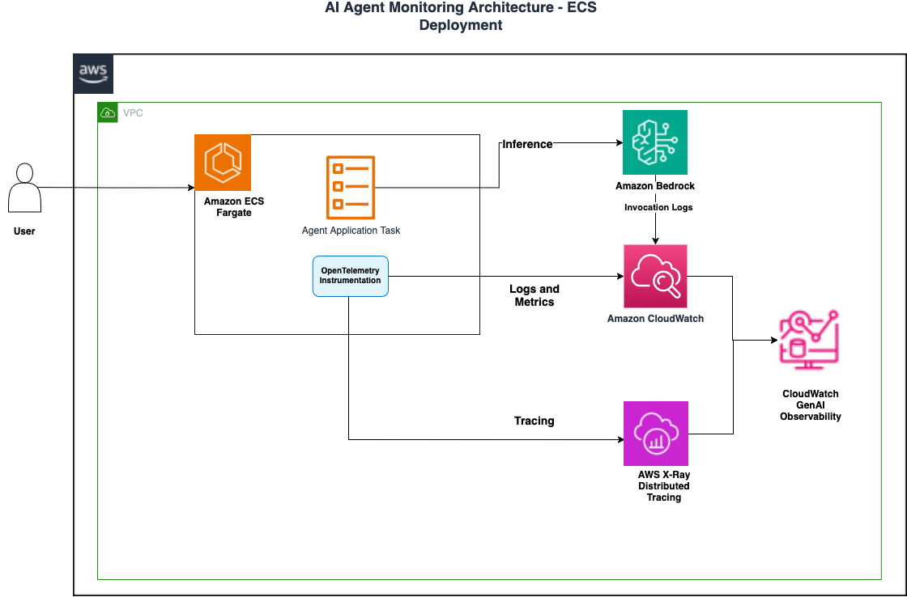

# Agentless CloudWatch Generative AI Observability for Agentic AI Apps on Amazon ECS

This project demonstrates a streamlined observability solution for AI applications running on Amazon ECS. We'll deploy a containerized AI agent using the Strands agent framework, powered by Amazon Bedrock's Claude Sonnet model, and show how CloudWatch Generative AI Observability provides comprehensive insights into your AI application's behavior, performance, and interactions. Our implementation showcases full-stack monitoring capabilities through the integration of AWS CloudWatch, OpenTelemetry, and AWS X-Ray, all while maintaining operational simplicity.

## Configuration Management

This project uses environment variables to manage Bedrock model IDs and AWS regions across all components.

## Architecture



## Features

### AI Agent Capabilities
- **AI Agent** with AWS Bedrock Claude Sonnet 4 model via inference profile
- **Calculator tool** for mathematical operations
- **Weather tool** for weather information (demo implementation)
- **Interactive console** interface

### Observability & Monitoring
- **OpenTelemetry integration** with AWS Distro for OpenTelemetry (ADOT)
- **CloudWatch Logs** for application logging
- **CloudWatch Metrics** for performance monitoring
- **AWS X-Ray** for distributed tracing

## Quick Start

### Prerequisites
- AWS CLI configured with appropriate permissions and Session Manager plugin installed
- Docker installed with buildx support
- Node.js and npm (for cdk if creating ECS cluster from scratch)
- Access to AWS Bedrock Claude Sonnet model
- Existing ECS cluster or EKS cluster (for EKS deployment)
- Transactional search enabled on Amazon CloudWatch

## Deployment Steps

### 1. Clone the Repository

```bash
git clone https://github.com/aws-samples/containers-blog-maelstrom.git
cd containers-blog-maelstrom/container-workloads-ecs-genai-observability
```

### 2. Create ECS Cluster (Optional - skip if ECS cluster already exists)
```bash
cd ecs/cdk
npm install
cdk bootstrap  # If first time using CDK in this region
cdk deploy 
```

### 3. Set Environment Variables

```bash
# Set required environment variables
export AWS_REGION=us-west-2
export BEDROCK_MODEL_ID="anthropic.claude-3-sonnet-20240229-v1:0"

# Optional: Set different model if available in your region or inference profile
# export BEDROCK_MODEL_ID="anthropic.claude-3-5-sonnet-20240620-v1:0"
```

### 4. Create ECR Repository and Build Image

```bash
# Set environment variables
export AWS_ACCOUNT_ID=$(aws sts get-caller-identity --query Account --output text)
export REGION=us-west-2
export REPO_NAME='strands-agent-monitoring'
export ECS_CLUSTER_NAME=<YOUR-ECS-CLUSTER-NAME>

# Build and push using automated script
cd app
./build.sh
```

### 5. Deploy ECS Service

```bash
cd ../ecs/scripts

# Deploy with all parameters
./deploy-to-ecs.sh strands-agent-stack \
    $AWS_ACCOUNT_ID.dkr.ecr.$AWS_REGION.amazonaws.com/$REPO_NAME:latest \
    $ECS_CLUSTER_NAME \
```

### 6. Monitor Application

#### Connect to Running Container

```bash
export ECS_RUNNING_TASKID=$(aws ecs list-tasks --cluster $ECS_CLUSTER_NAME --desired-status RUNNING --query 'taskArns[0]' --output text |  cut -d'/' -f3)

aws ecs execute-command \
--cluster $ECS_CLUSTER_NAME \
--task $ECS_RUNNING_TASKID \
--container strands-agent-console \
--interactive \
--command "/bin/bash -c 'opentelemetry-instrument python main.py'" \
--region $REGION
```

#### Review CloudWatch Logs

```bash
# View application logs
aws logs tail /ecs/strands-agent-sample --follow --region $AWS_REGION

# View OpenTelemetry logs
aws logs tail strands-agent-logs-ecs --follow --region $AWS_REGION

# Check service status
aws ecs describe-services --cluster strands-agent-sample --services strands-agent-console-service --region $AWS_REGION
```

## EKS Deployment

```bash
cd eks/scripts
# Use the ECR image URI from the build step
./deploy.sh $AWS_ACCOUNT_ID.dkr.ecr.$AWS_REGION.amazonaws.com/$REPO_NAME:latest [namespace]
```

## Verify Permissions
```bash
cd ecs/scripts
./verify-permissions.sh
```

## Environment Variables Reference

- `AWS_REGION`: AWS region (default: us-west-2)
- `BEDROCK_MODEL_ID`: Bedrock model identifier (default: anthropic.claude-3-sonnet-20240229-v1:0)
- `CLUSTER_NAME`: ECS cluster name (default: strands-agent-sample)
- `VPC_ID`: VPC ID for ECS deployment (auto-detected)
- `SUBNET_IDS`: Subnet IDs for ECS deployment (auto-detected)

## Monitoring & Observability

### CloudWatch Integration
- **Log Groups**: Application and OpenTelemetry logs
- **Metrics Namespace**: `agents`
- **X-Ray Service**: Distributed tracing

### View Logs
```bash
# ECS application logs
aws logs tail /ecs/strands-agent-sample --follow --region $AWS_REGION

# OpenTelemetry logs
aws logs tail strands-agent-logs-ecs --follow --region $AWS_REGION

# EKS logs
kubectl logs -f deployment/strands-agent-eks
```

## Cleanup

### ECS Cleanup
```bash
# Delete ECS service stack
aws cloudformation delete-stack --stack-name strands-agent-stack --region $AWS_REGION

# Delete ECS cluster (CDK)
cd ecs/cdk
cdk destroy

# Delete ECR repository
aws ecr delete-repository --repository-name strands-agent-monitoring --force --region $AWS_REGION
```

### EKS Cleanup
```bash
kubectl delete -f eks/templates/deployment.yaml
```