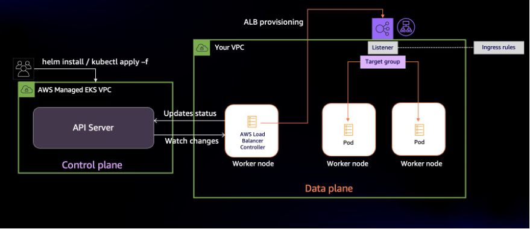
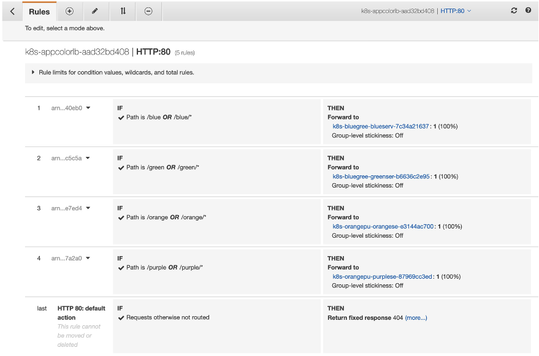
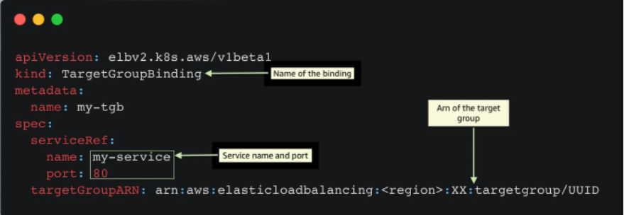

## A deeper look at Ingress Sharing and Target Group Binding in AWS Load Balancer Controller

[AWS Load Balancer Controller](https://kubernetes-sigs.github.io/aws-load-balancer-controller/v2.4/)is a Kubernetes controller that integrates Application Load Balancers (ALB) and Network Load Balancers (NLB) with Kubernetes workloads. It allows you to configure and manage load balancers using Kubernetes API. Based on our conversations with customers, we have identified two AWS Load Balancer Controller features that need further explanation. In this post, we show how you can reduce costs by using Ingress Grouping and integrate existing load balancers using target group binding. 

Kubernetes has two ways to expose Services to clients external to the cluster. Kubernetes Service of type `LoadBalancer` or `Ingress` resources. Both methods rely on AWS Elastic Load Balancing under the hood. Network Load Balancer (NLB) is designed to handle high amounts of traffic and is optimized to handle layer 4 (TCP and UDP) traffic. And Application Load Balancer (ALB) is designed to handle web traffic and is optimized to handle layer 7 (HTTP and HTTPS) traffic.   The AWS Load Balancer Controller automates the management of ALBs and NLBs' lifecycle and configuration as you deploy workloads in your cluster.

## Kubernetes Ingress and Application Load Balancer


In Kubernetes, Ingress is an API object that provides an external, load-balanced IP address to access the services in a cluster. It acts as a layer 7 (HTTP/HTTPS) reverse proxy and allows you to route traffic to different services based on the requested host and URL path. The AWS Load Balancer controller provisions and configures an ALB on your behalf whenever you create an Ingress. 

In a microservice architecture, it is common to have multiple services deployed within a single Kubernetes cluster. Each service may have different requirements for external access, routing rules, SSL/TLS termination, and so on. In such cases, it may be necessary to use multiple Ingress resources to manage external access to the services. Applications typically include Ingress resource definition in deployment artifacts (along with Deployments, Services, Volumes, etc.) since they contain application-specific routing rules. Separating Ingress resources is a good practice as it allows teams to modify their Ingress resources without affecting traffic routing for other applications in the cluster. 

Although using the AWS Load Balancer Controller for Ingresses can be beneficial, there is a disadvantage to this approach. The controller creates an Application Load Balancer (ALB) for each Ingress, which can result in a higher number of load balancers than necessary. This can lead to increased costs since each ALB incurs an hourly charge. Having a separate load balancer for each Service may quickly become too expensive. However, you can reduce costs by sharing ALBs across multiple Ingresses, thereby minimizing the number of ALBs needed.

To minimize the number of Application Load Balancers (ALBs) in your architecture, you can use the AWS Load Balancer Controller to group Ingresses. The controller offers an [IngressGroup](https://kubernetes-sigs.github.io/aws-load-balancer-controller/v2.2/guide/ingress/annotations/#ingressgroup) feature that enables you to share a single ALB with multiple Ingress resources. This allows you to consolidate your load balancers and reduce costs. Additionally, the Ingress group can include Ingresses from different namespaces, making it easier to manage access to your microservices across multiple namespaces. 

## Ingress groups in action

Let’s walk through the process of sharing ALBs with multiple Ingresses. For this demonstration, we’ll deploy four web applications in two different namespaces. Then, we’ll show you how multiple Ingresses can be configured and grouped to share a single ALB. We’ll use `[group.name](http://group.name/)` annotations to enable grouping of multiple Ingress resources.


The diagram above shows the operations the AWS Load Balancer Controller performs once installed. It watches the Kubernetes API server for updates to Ingress resources. When it detects changes, it updates resources such as the Application Load Balancer, listeners, target groups, and listener rules.

* A Target group gets created for every Kubernetes Service mentioned in the Ingress resource
* Listeners are created for every port defined in the [Ingress resource’s annotations](https://kubernetes-sigs.github.io/aws-load-balancer-controller/v2.2/guide/ingress/annotations/#traffic-listening)
* Listener rules (also called ingress rules) are created for each path in Ingress resource definition

In this post, we will run four variants of a web application that renders a web page with different background colors. The `blue` and `green` apps will run in the `blue-green-ns` namespace, and the `orange` and `purple` apps will run in the `orange-purple-ns` namespace. With apps deployed, we’ll create two I`ngress` resources named `blue-green-ingress` and `orange-purple-ingress`. Ingress rules will configure path-based routing. 

In the diagram below, when ALB receives traffic, it will route requests to Pods based on the Ingress rules. The `blue-green-ingress` Ingress will have the routing rules to access `blue` and `green` web apps, and will be deployed in the `blue-green-ns` namespace. Similarly, the `orange-purple-ingress` Ingress will have the routing rules to access `orange` and `purple` web apps, and will be deployed in namespace `orange-purple-ns`.


## Solution walkthrough

You’ll need the following things to follow along:

* An existing [EKS Cluster](https://docs.aws.amazon.com/eks/latest/userguide/getting-started-eksctl.html) with an existing node group
* [AWS Load Balancer Controller](https://kubernetes-sigs.github.io/aws-load-balancer-controller/v2.4/deploy/installation/)  is installed in the cluster
* Tools required on a machine with access to the AWS and Kubernetes API Server. This could be your local or a remote system or an AWS Cloud9 environment. You’ll need these tools installed:
    * [AWS CLI](https://docs.aws.amazon.com/cli/latest/userguide/cli-chap-install.html)
    * [eksctl](https://eksctl.io/introduction/)
    * [kubectl](https://docs.aws.amazon.com/eks/latest/userguide/install-kubectl.html)
    * [Helm](https://helm.sh/docs/intro/install/)
    * [Docker](https://docs.docker.com/get-docker/)

The code is available on Github. Start by cloning the code and deploy the sample application: 

```
`git clone https``:``//github.com/aws-samples/containers-blog-maelstrom.git``
kubectl apply -f containers-blog-maelstrom/aws-lb-controller-blog/ingress-grouping/
`
```

The output should show the resources you’ve created:

```
namespace/blue-green-ns created
deployment.apps/green-app created
deployment.apps/blue-app created
service/green-service created
service/blue-service created
ingress.networking.k8s.io/blue-green-ingress created
namespace/orange-purple-ns created
deployment.apps/orange-app created
deployment.apps/purple-app created
service/orange-service created
service/purple-service created
ingress.networking.k8s.io/orange-purple-ingress created
```

Check the status of resources in namespace `blue-green-ns` . 

```
kubectl -n blue-green-ns get all
```

The Pods should be in running state:

```

NAME                             READY   STATUS    RESTARTS   AGE
pod/blue-app-9b7bd7578-gjqrm     1/1     Running   0          5d23h
pod/blue-app-9b7bd7578-sgjvd     1/1     Running   0          5d23h
pod/green-app-695664547f-lmq4b   1/1     Running   0          5d23h
pod/green-app-695664547f-lrjh8   1/1     Running   0          5d23h

NAME                    TYPE       CLUSTER-IP      EXTERNAL-IP   PORT(S)        AGE
service/blue-service    NodePort   172.20.93.229   <none>        80:32402/TCP   5d23h
service/green-service   NodePort   172.20.63.132   <none>        80:30106/TCP   5d23h

NAME                        READY   UP-TO-DATE   AVAILABLE   AGE
deployment.apps/blue-app    2/2     2            2           5d23h
deployment.apps/green-app   2/2     2            2           5d23h
```

Similarly, verify that the application Pods are operational in the  `orange-purple-ns` namespace.

We also have two Ingress resources:

```
kubectl get ingress -A
```

You can see that both Ingress resources have the same `ADDRESS`:

```
NAMESPACE          NAME                    CLASS   HOSTS   ADDRESS                                                            PORTS   AGE
blue-green-ns      blue-green-ingress      alb     *       k8s-appcolorlb-9527f4eb57-1779454964.us-west-2.elb.amazonaws.com   80      5m52s
orange-purple-ns   orange-purple-ingress   alb     *       k8s-appcolorlb-9527f4eb57-1779454964.us-west-2.elb.amazonaws.com   80      5m25s
```

We didn’t end up with one ALB for each Ingress is because we have grouped Ingresses. Before looking further at the Ingress, let’s verify the routing works the way we want it to. 

Get the address assigned to the ALB:

```
kubectl get ingress blue-green-ingress -n blue-green-ns \
  -o=jsonpath="{'http://'}{.status.loadBalancer.ingress[].hostname}{'\n'}"
```

Navigate to the address of the ALB at `/green` path. A webpage with Green background(as shown below) indicates that the routing is working as intended.
 Similarly, the `/blue` , `/orange`, and `/purple` paths should show a page each with their corresponding background color.
 Let’s get back to the reason for having just one ALB for both Ingresses. Describe either of the Ingresses and you’d notice that they include the `[alb.ingress.kubernetes.io/group.name](http://alb.ingress.kubernetes.io/group.name)` annotation. 

```
kubectl -n blue-green-ns describe ingress blue-green-ingress
```

Below are the Ingress annotations from the [blue-green-ingress.yaml](https://github.com/aws-samples/containers-blog-maelstrom/blob/main/aws-lb-controller-blog/ingress-grouping/blue-green-ingress.yaml):

```
  annotations:
    alb.ingress.kubernetes.io/scheme: internet-facing
    alb.ingress.kubernetes.io/target-type: ip
    alb.ingress.kubernetes.io/group.name: app-color-lb
```

By adding an `alb.ingress.kubernetes.io/group.name` annotation, you can assign a group to an Ingress. Ingresses with same `group.name` annotation form an "IngressGroup". An IngressGroup can have Ingresses in multiple namespaces. 

In our example, both `blue-green-ingress` and `orange-purple-ingress` use "app-color-lb" as the value of this annotation, which puts them in the same group. This enables the Application Load Balancer to route traffic for both the `Ingresse`s based on their corresponding routing rules. You can view the ingress rules as they are configured as listener rules in ALB. The screenshot below shows the `Rules` that the AWS Load Balancer Controller created: 
 With IngressGroup, a single ALB serves as the entry point for all four applications. This change in design reduces the number of ALBs we need and results in cost savings. 


### Design considerations with IngressGroup

An important aspect to consider before using IngressGroup in a multi-tenant environment is conflict resolution. When AWS Load Balancer Controller configures ingress rules in ALB, it uses the `group.order` field to set the order of evaluation. If you don’t declare a value for `group.order`, the Controller defaults to 0. 

ALB determines how to route requests by applying the ingress rules. The order of rule evaluation is set by the `group.order` field. Rules with lower order value are evaluated first. By default, the rule order between Ingresses within an IngressGroup is determined by the lexical order of Ingress’s namespace/name. 

This default ordering of ingress rules can lead to application-wide incorrect routing if any of the Ingresses have misconfigured rules. Teams should create explicit ingress rules to avoid routing conflicts between multiple teams or applications and use `group.order` to set the order of execution. 

Here’s another key consideration with using IngressGroup in a shared environment, The name of the IngressGroup is across the cluster as an IngressGroup can have Ingresses in multiple namespaces. Teams should avoid naming collisions by using unambiguous values for `group.name`. The AWS Load Balancer Controller currently doesn’t offer fine grained controls to control access to an IngressGroup. So, avoid giving your group a generic name like “MyIngressGroup”, because someone else in the cluster may create an Ingress with the same name, which adds their Ingress to your group. If they create higher priority rules, they may highjack your application’s traffic. 

AWS ALB (Application Load Balancer) has several limits on the number of rules that can be configured per listener. These limits are in place to prevent overloading the load balancer and impacting its performance. For e.g. Each ALB listener can have up to 100 rules by default. It's important to check the [AWS documentation](https://docs.aws.amazon.com/elasticloadbalancing/latest/application/load-balancer-limits.html) for the latest information on these limits.

* * *

## Decouple Load Balancers and Kubernetes resources with TargetGroupBinding

In the previous section, we described the operations the AWS Load Balancer performs when you create an Ingress. The controller creates an ALB when a new Ingress resource is created. If an Ingress is part of IngressGroup, the controller merges ingress rules across Ingresses and configures the ALB, listeners, and rules. The lifecycle of the Load Balancer is tied to the associated one or more Ingresses. If you delete Ingress, the AWS Load Balancer Controller will delete the ALB given there are no other Ingresses in the group. The controller creates and configures load balancers to route traffic to your applications. 

There are a few scenarios in which customers prefer managing a load balancer themselves. They separate the creation and deletion load balancers from the lifecycle of a Service or Ingress. We have worked with customers that do not give EKS clusters the permission to create load balancers. In other situations, teams wanted to migrate workloads to EKS but wanted to preserve the load balancer. In both scenarios, teams needed to the ability to use a  pre-existing load balancer to expose Kubernetes Services. 

`TargetGroupBinding` is a custom resource managed by the AWS Load Balancer Controller. It allows you to expose  Kubernetes applications using existing load balancers. A `TargetGroupBinding` resource binds a Kubernetes Service with a load balancer target group. When you create a `TargetGroupBinding` resource, the controller automatically configures the target group to route traffic to a Service.  Here’s an example of a TargetGroupBinding resource:
 *Example of a TargetGroupBinding resource*

An obvious advantage is that the load balancer remains static as you create and delete Ingresses or even clusters. The lifecycle of the load balancer becomes independent from the Service(s) its exposing. An even bigger benefit is that now you can use an pre-existing ALB to distribute traffic to multiple EKS clusters. 

### Load balance application traffic across clusters

ALB can distribute traffic to multiple backends using [weighted target groups](https://aws.amazon.com/blogs/aws/new-application-load-balancer-simplifies-deployment-with-weighted-target-groups/). You can use this feature to route traffic to multiple clusters by first creating a target group for each cluster and then binding the target group to Services in multiple clusters. This strategy allows you to control the percentage of traffic you send to each cluster. 

Such traffic controls are especially useful when performing blue/green cluster upgrades. You can migrate traffic from the older cluster to the newer in a controlled manner. 
 *Load balance application traffic across clusters*

Customers also use this architecture to improve workload resilience in multi-cluster environments. There are customers that deploy their applications to multiple Kubernetes clusters simultaneously. By doing this, they eliminate any Kubernetes cluster from becoming a single point of failure. In case one cluster experiences disrupting events, you can remove it from load balancer targets. 

### Walkthrough

To demonstrate how TargetGroupBinding works in action, we’re going to deploy two versions of a web application in an EKS cluster. We’ll name the deployments “black” and “red”. Both applications will run in their dedicated namespaces. We’ll distribute traffic evenly between the two replicas of our application using an ALB. 

We’ll create two Services to expose the applications. We will then associate these Services with target groups by creating TargetGroupBinding resources. 

**Pre-requisite:**
To be able to follow along, you’ll need:

* An EKS cluster with AWS Load Balancer Controller installed
* Ability to create Application Load Balancer, target groups, and listener

### Setup Load Balancing

Set the IDs of your VPC and public subnets in environment variables:

```
VPC_ID=vpc-id
PUB_SUBNET_IDS=$(aws ec2 describe-subnets --filter Name=vpc-id,Values=$VPC_ID --query 'Subnets[?MapPublicIpOnLaunch==`true`].SubnetId')
```

Create an Application Load Balancer: 

```
ALB_ARN=$(aws elbv2 create-load-balancer \
  --name TargetGroupBinding-Demo-ALB\
  --type application \
  --subnets ${PUB_SUBNET_IDS} \
  --query 'LoadBalancers[].LoadBalancerArn' \
  --output text)
```

Create a listener and two target groups in the same VPC as your EKS cluster:

```
`RED_TG``=``$``(``aws elbv2 create``-``target``-``group`` \`
`  ``--``name ``my``-``service``-``red \`
`  ``--``port ``80`` \`
`  ``--``protocol HTTP \`
`  ``--``target``-``type ip \`
`  ``--``vpc``-``id $VPC_ID \`
`  ``--``query ``'TargetGroups[].TargetGroupArn'`` \`
`  ``--``output text``)
  `
`BLACK_TG``=``$``(``aws elbv2 create``-``target``-``group`` \`
`  ``--``name ``my``-``service``-``black \`
`  ``--``port ``80`` \`
`  ``--``protocol HTTP \`
`  ``--``target``-``type ip \`
`  ``--``vpc``-``id $VPC_ID \`
`  ``--``query ``'TargetGroups[].TargetGroupArn'`` \`
`  ``--``output text``)`
`  `
LISTENER_ARN=$(aws elbv2 create-listener \
   --load-balancer-arn $ALB_ARN \
   --protocol HTTP \
   --port 80 \
   --default-actions \
   '[{"Type": "forward", 
   "Order": 1, 
   "ForwardConfig": 
     {"TargetGroups": [
     {"TargetGroupArn": "'${RED_TG}'", "Weight": 50},
     {"TargetGroupArn": "'${BLACK_TG}'", "Weight": 50}
     ]
   }
   }]' \
   --query 'Listeners[].ListenerArn' \
   --output text)
```

Here’s a screenshot of the target group rules in AWS Management Console after applying the configuration:


### Deploy applications

Now that we have an Application Load Balancer and the two target groups created, we will need to associate the two target groups with corresponding Services. Let’s create manifests for the two target group binding CRDs:

```
# Red Service target group binding
cat > containers-blog-maelstrom/aws-lb-controller-blog/target-grp-binding/red-app-tgb.yaml << EOF
apiVersion: elbv2.k8s.aws/v1beta1
kind: TargetGroupBinding
metadata:
  name: red-tgb
  namespace: red-ns
spec:
  serviceRef:
    name: red-service
    port: 80
  targetGroupARN: ${RED_TG}
EOF

# Black Service target group binding
cat > containers-blog-maelstrom/aws-lb-controller-blog/target-grp-binding/black-app-tgb.yaml << EOF
 apiVersion: elbv2.k8s.aws/v1beta1
 kind: TargetGroupBinding
 metadata:
   name: black-tgb
   namespace: black-ns
 spec:
   serviceRef:
     name: black-service
     port: 80
   targetGroupARN: ${BLACK_TG}
EOF
```


Next, create the application and target group bindings in your cluster:

```
kubectl apply -f containers-blog-maelstrom/aws-lb-controller-blog/target-grp-binding/
```

Let’s switch back to the AWS Management Console to visualize this configuration. Navigate to either of the target groups and you’ll see that the AWS Load Balancer Controller has registered corresponding Pods as targets
 Once the targets are in `healthy` status, navigate to the DNS name of the ALB and open it in a browser. You may get a page with a black or blue background. Refresh the page and the colors should alternate. 


> Note: if you receive a timeout error when accessing the page, verify that the ALB’s security groups have an inbound rule to permit HTTP traffic from your IP address.  


If you get pages with alternating background, ALB is forwarding your requests to the two Services running in their respective namespace. We can even move `/black` service to another cluster to load balance traffic between multiple EKS clusters. 

### Clean up

Delete the resources created in this post:

```
kubectl delete -f containers-blog-maelstrom/aws-lb-controller-blog/ingress-grouping/
kubectl delete -f containers-blog-maelstrom/aws-lb-controller-blog/target-grp-binding/
aws elbv2 delete-load-balancer --load-balancer-arn $ALB_ARN
aws elbv2 delete-listener --listener-arn $LISTENER_ARN
aws elbv2 delete-target-group --target-group-arn $RED_TG
aws elbv2 delete-target-group --target-group-arn $BLACK_TG

```

## Conclusion

In this blog we showed how to save costs by sharing an Application Load Balancer with multiple Ingress resources. We also explored how to decouple the lifecycle of load balancers from that of Service and Ingress resources in a Kubernetes cluster. Finally, we learned how you can use ALB weighted target groups to route traffic to multiple clusters using AWS Load Balancer Controller’s TargetGroupBinding feature.

For more information, see the following references:

* AWS Load Balancer Controller [LiveDoc](https://kubernetes-sigs.github.io/aws-load-balancer-controller/v2.4/)
* Different [Annotations](https://kubernetes-sigs.github.io/aws-load-balancer-controller/v2.4/guide/ingress/annotations/) supported
* [Github Link](https://github.com/kubernetes-sigs/aws-load-balancer-controller/) for the AWS Load Balancer Controller project
* [Previous Blog](https://aws.amazon.com/blogs/containers/introducing-aws-load-balancer-controller/) on AWS Load Balancer Controller


### Elamaran Shanmugam

Elamaran (Ela) Shanmugam is a Sr. Container Specialist Solutions Architect with Amazon Web Services. Ela is a Container, Observability and Multi-Account Architecture SME and helps AWS partners and customers to design and build scalable, secure and optimized container workloads on AWS. His passion is building and automating Infrastructure to allow customers to focus more on their business. He is based out of Tampa, Florida and you can reach him on twitter @IamElaShan


### Re Alvarez Parmar

In his role as Containers Specialist Solutions Architect at Amazon Web Services. Re advises engineering teams with modernizing and building distributed services in the cloud. Prior to joining AWS, he spent over 15 years as Enterprise and Software Architect. He is based out of Seattle. You can connect with him on LinkedIn linkedin.com/in/realvarez/


### Ratnopam Chakrabarti

Ratnopam Chakrabarti is a Specialist Solutions Architect for Containers and App modernization at Amazon Web Services (AWS). In his current role, Ratnopam helps customers in accelerating their cloud adoption by leveraging AWS container technologies at scale. He is based out of Dallas, Texas. You can connect with him on LinkedIn https://www.linkedin.com/in/ratnopam-chakrabarti/.


### Praseeda Sathaye

Praseeda Sathaye is a Principal Specialist SA for App Modernization and Containers at Amazon Web Services based in Bay Area California. She has been focused on helping customers speed their cloud-native adoption journey by modernizing their platform infrastructure, internal architecture using Microservices Strategy, Containerization, DevOps, Service Mesh, and Cloud Migration. At AWS she is working on AWS services like EKS, App Mesh, ECS and helping customers to run at scale.
