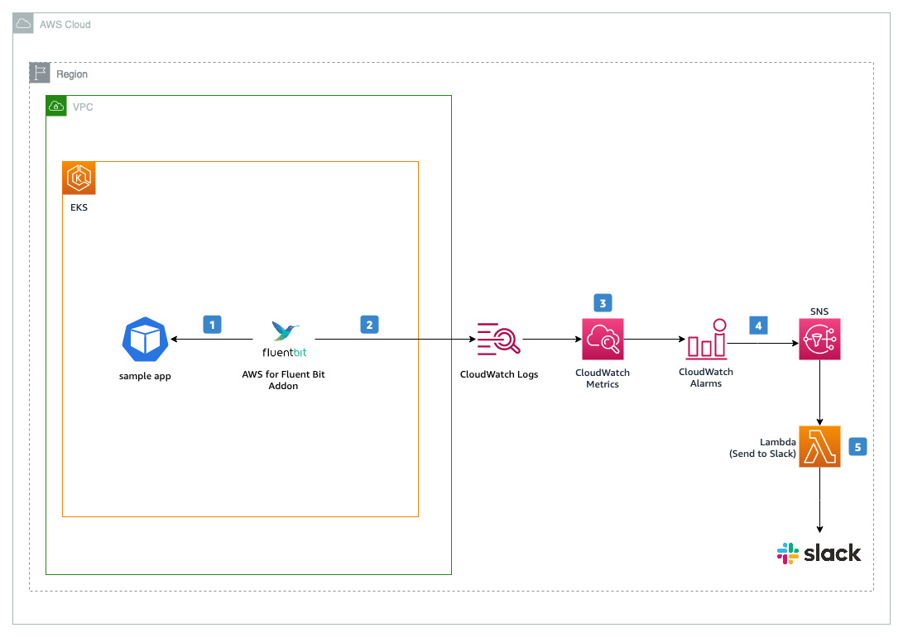
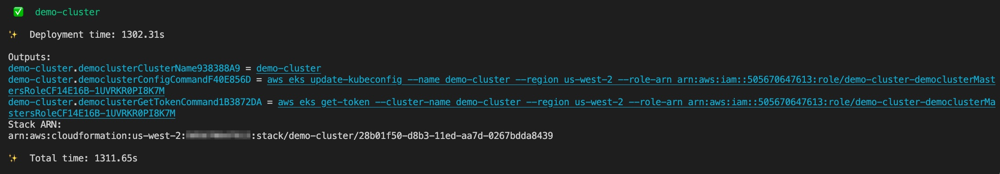
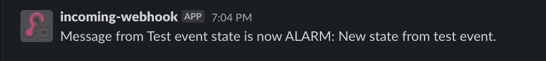
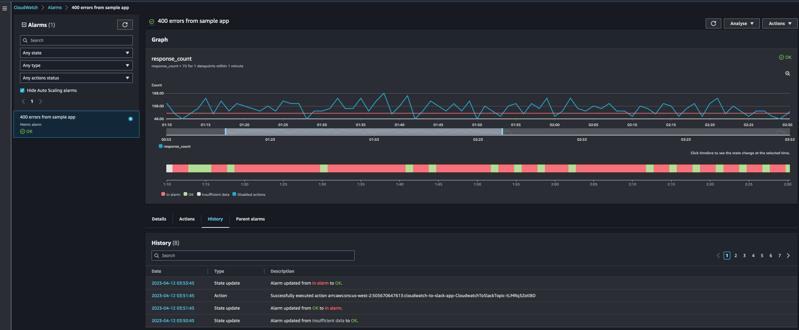
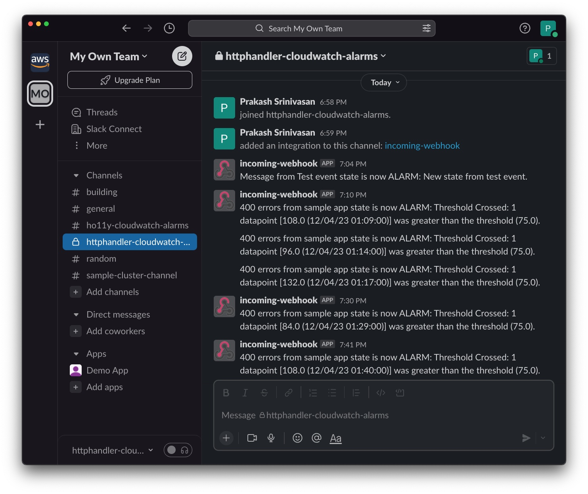

# Unlocking Insights: Turning Application Logs into Actionable Metrics

### Introduction

Modern software development teams understand the importance of observability as a critical aspect of building reliable applications. Observability practices allow software teams to proactively diagnose issues, detect performance bottlenecks, and improve the overall reliability of the system. However, it is a fairly recent trend and still lacks industry-wide adoption. 

As organizations standardize on containers, they often lift and shift legacy applications into containers. The only insight such applications provide is through logs. Unlike modern applications, they don’t generate metrics in easy to consume Prometheus format. As a result, teams find it challenging to capture errors and extract meaningful insights from application logs. 

In this post we demonstrate how to improve the observability of applications that don’t generate metrics. We use [Amazon CloudWatch](https://aws.amazon.com/cloudwatch/) to create metrics from log events using filters. The post uses [Amazon EKS](https://aws.amazon.com/eks/) to run the application. Customers can also use this method with applications running in Amazon ECS, Amazon EC2, or AWS Lambda. 

### Solution Overview

In this post we use [Amazon EKS Blueprints](https://github.com/aws-quickstart/cdk-eks-blueprints) as create an Amazon EKS cluster with [AWS for Fluent Bit Add-on](https://aws-quickstart.github.io/cdk-eks-blueprints/addons/aws-for-fluent-bit/) to aggregate application logs in Amazon CloudWatch. We deploy a sample application that produces logs in Common Log Format. The application is designed to inject failures at random. Using CloudWatch metric filters, we match terms in application’s logs to convert log data into metrics. 

We also create alarms in CloudWatch to detect increased error rate. Whenever the sample application’s error rate breaches the set threshold, a notification gets sent to a Slack channel. 



**Here is a functional flow of this solution:**

1. [AWS for Fluent Bit Add-on](https://aws-quickstart.github.io/cdk-eks-blueprints/addons/aws-for-fluent-bit/) collects and processes application logs
2. AWS for Fluent Bit Add-on forwards logs to [Amazon CloudWatch Logs](https://docs.aws.amazon.com/AmazonCloudWatch/latest/logs/WhatIsCloudWatchLogs.html) where they are stored in log groups
3. [Amazon CloudWatch custom metric filters](https://docs.aws.amazon.com/AmazonCloudWatch/latest/logs/MonitoringPolicyExamples.html) monitors required events in respective CloudWatch log groups
4. [CloudWatch Alarm](https://docs.aws.amazon.com/AmazonCloudWatch/latest/monitoring/AlarmThatSendsEmail.html) triggers notification to Amazon SNS when a threshold is breached
5. Amazon SNS invokes an Amazon Lambda function, which in-turn sends CloudWatch alarm notifications to Slack

#### Prerequisites

Install the following utilities on a Linux based host machine, which can be an [Amazon EC2](https://aws.amazon.com/ec2/) instance, [AWS Cloud9](https://docs.aws.amazon.com/cloud9/latest/user-guide/setting-up.html) instance or a local machine with access to your AWS account:

* [AWS CLI version 2](https://docs.aws.amazon.com/cli/latest/userguide/getting-started-install.html#getting-started-install-instructions) to interact with AWS services using CLI commands
* [Node.js](https://nodejs.org/en/download/current/) (v16.0.0 or later) and [npm](https://docs.npmjs.com/downloading-and-installing-node-js-and-npm) (8.10.0 or later)
* [AWS CDK v2.70.0](https://docs.aws.amazon.com/cdk/v2/guide/getting_started.html#getting_started_install)or later to build and deploy cloud infrastructure and Kubernetes resources programmatically
* [AWS SAM CLI](https://docs.aws.amazon.com/serverless-application-model/latest/developerguide/install-sam-cli.html) to deploy AWS Lambda function
* [Kubectl](https://docs.aws.amazon.com/eks/latest/userguide/install-kubectl.html) to communicate with the Kubernetes API server
* [Git](https://git-scm.com/download/linux) to clone required source repository from GitHub

Let’s start by setting a few environment variables:

```
export CAP_ACCOUNT_ID=$(aws sts get-caller-identity --query 'Account' --output text)
export CAP_CLUSTER_REGION="us-west-2"
export CAP_CLUSTER_NAME="demo-cluster"
export CAP_FUNCTION_NAME="cloudwatch-to-slack"
```

Clone the sample repository which contains the code for our solution :

```
git clone https://github.com/aws-samples/containers-blog-maelstrom.git
cd ./containers-blog-maelstrom/aws-cdk-eks-app-alarms-to-slack
```

#### Bootstrap the Environment

As the solution uses [Amazon EKS CDK Blueprints](https://github.com/aws-quickstart/cdk-eks-blueprints/tree/main/docs) to provision an Amazon EKS cluster, you’ll have to bootstrap your environment (i.e., a combination of AWS account and AWS Region).

Bootstrap your environment and install all Node.js dependencies:

```
bash ./bootstrap-env.sh
```

### Create EKS cluster

Once you’ve bootstrapped the environment, create the cluster:

```
cdk deploy "*" --require-approval never
```

Deployment will take approximately 20-30 minutes to complete. Upon completion, you will have a fully functioning EKS cluster deployed in your account. 



Please copy and run the `aws eks update-kubeconfig ...` command as shown in the above screenshot to gain access to your Amazon EKS cluster using `kubectl`.

#### AWS for Fluent Bit Add-on

AWS for Fluent Bit Add-on aggregates application logs and forwards them to CloudWatch. To forward logs to CloudWatch logs, you need to provide IAM role that grants required permissions. [Amazon EKS CDK Blueprints](https://github.com/aws-quickstart/cdk-eks-blueprints/tree/main/docs) provides options to configure Fluent-Bit add-on as well as create IAM policies with required permissions.

Verify that Fluent-Bit is running in your cluster:

```
kubectl get po -n kube-system \
-l app.kubernetes.io/name=aws-for-fluent-bit

NAME                                        READY   STATUS    RESTARTS   AGE
blueprints-addon-aws-for-fluent-bit-9db6l   1/1     Running   0          30m
```

#### Deploy Sample Application

Next, let us deploy a sample application [HTTPHandler](https://gallery.ecr.aws/k9t3d5o9/badhttphandler), which is an HTTP server that injects error randomly. We’ll also deploy a `curl` container to generate traffic. 

Deploy the sample application `httphandler` and `curl`:

```
kubectl apply -f ./templates/sample-app.yaml
```

Let’s send a few request to the sample application to see the logs it produces. 

```
kubectl exec -n sample-app -it \
  curl -- sh -c 'for i in $(seq 1 15); do curl http://httphandler.sample-app.svc.cluster.local; sleep 1; echo $i; done'
```

Then, check the logs and observe response code and count. With every HTTP request, this sample application injects errors randomly and respective response code and counts will be logged.

```
kubectl -n sample-app logs -l app=httphandler

2023/04/14 21:40:35 Listening on :8080...
192.168.99.44 - - [14/Apr/2023:21:40:44 +0000] "GET / HTTP/1.1" 500 22
192.168.99.44 - - [14/Apr/2023:21:40:45 +0000] "GET / HTTP/1.1" 200 13
192.168.99.44 - - [14/Apr/2023:21:40:46 +0000] "GET / HTTP/1.1" 200 13
192.168.99.44 - - [14/Apr/2023:21:40:47 +0000] "GET / HTTP/1.1" 200 13
192.168.99.44 - - [14/Apr/2023:21:40:48 +0000] "GET / HTTP/1.1" 500 22
192.168.99.44 - - [14/Apr/2023:21:40:49 +0000] "GET / HTTP/1.1" 200 13
192.168.99.44 - - [14/Apr/2023:21:40:50 +0000] "GET / HTTP/1.1" 200 13
```

AWS for Fluent Bit Add-on is configured to forward application logs with log key “log” to CloudWatch log group with name like  `/aws/eks/fluentbit-cloudwatch/<CAP_CLUSTER_NAME>/workload/<NAMESPACE>`. Hence, sample application (httphandler) logs are forwarded to log group `/aws/eks/fluentbit-cloudwatch/demo-cluster/workload/sample-app.` There will be one log stream per pod.

#### Create CloudWatch Metrics

You can convert log data into numerical CloudWatch metrics using [metric filters](https://docs.aws.amazon.com/AmazonCloudWatch/latest/logs/MonitoringLogData.html). Metric filters allow you to configure rules to extract metric data from log messages. Logs from `httphandler` are parsed using filter pattern `[dttm, mode, field, curlpodip, user, id, timestamp, request, statuscode>=200, size]` and used in the below `put-metric-filter` command to create metric filter with dimension on response status code.

Create a metrics filter:

```
aws logs put-metric-filter --region ${CAP_CLUSTER_REGION} \
--log-group-name /aws/eks/fluentbit-cloudwatch/${CAP_CLUSTER_NAME}/workload/sample-app \
--cli-input-json file://templates/sample-app-metric-filter.json
```

#### Send CloudWatch alarms to Slack

At this time, application logs are being forwarded to CloudWatch and CloudWatch is generating metrics from logs. Now we’d like to send a Slack notification to our SRE channel so that when errors exceed a set threshold, the team gets notified immediately. 

#### **Create an Incoming Webhook in Slack**

Slack allows you to send messages from other applications using incoming webhook. Please refer to [sending messages using incoming webhooks](https://api.slack.com/messaging/webhooks) for more details. We will use this incoming webhook to send notifications to a Slack Channel whenever an alarm is triggered.

 Follow these steps to configure incoming webhook in Slack:

1. Create or pick a Slack channel to send CloudWatch alarms notifications.
2. Go to https://<your-team-domain>.slack.com/services/new and search for "Incoming WebHooks", select and click "Add to Slack".
3. Under post to channel, choose the Slack channel where messages will be sent and click "Add Incoming WebHooks Integration".
4. Copy webhook URL from the setup instructions and save it. You’ll use this URL in the Lambda function.

#### **Create a KMS Key**

In order to increase security posture of incoming webhook URL, we will now encrypt it using [AWS KMS keys](https://docs.aws.amazon.com/kms/latest/developerguide/concepts.html#kms_keys). Create KMS Key and key alias using below mentioned commands:

```
CAP_KMS_KEY_ID=$(aws kms create-key --region ${CAP_CLUSTER_REGION} \
--description "Encryption Key for lambda function ${CAP_FUNCTION_NAME}" \
--key-spec SYMMETRIC_DEFAULT --key-usage ENCRYPT_DECRYPT \
--query KeyMetadata.KeyId --output text)

aws kms create-alias --region ${CAP_CLUSTER_REGION} \
--alias-name alias/${CAP_FUNCTION_NAME}-key --target-key-id $CAP_KMS_KEY_ID

```

#### **Create an Amazon Lambda function**

As next step, create a Lambda function to send CloudWatch alarm notifications to Slack. The code below uses [AWS Serverless Application Model (SAM)](https://aws.amazon.com/serverless/sam/) to create:

1. An Amazon SNS topic to which notifications will be published by CloudWatch alarm
2. A Lambda execution role to grant function permission with basic access and to decrypt using KMS Key
3. A Lambda function to send notifications to Slack using incoming webhook URL
4. Lambda permissions for SNS to trigger the Lambda function

The script `deploy-sam-app.sh`  intakes the following two input values to deploy SAM template.

1. Slack incoming webhook URL which you created previously. 
2. Slack channel name (you selected previously) to which notifications need to be sent

 `deploy-sam-app.sh` script, Slack incoming webhook URL will be encrypted (client-side) using KMS Key to specific encryption context. Lambda function will decrypt using same encryption context. Lambda execution role is provided with fine-grained access to use KMS Key only for the specific encryption context. 
Run the below command to deploy SAM template.

```
bash ./deploy-sam-app.sh
```

**Test Lambda function**

Let’s validate the Lambda function by pushing a test event using the payload available at `templates/test-event.json`:

```
aws lambda invoke --region ${CAP_CLUSTER_REGION} \
--function-name ${CAP_FUNCTION_NAME} \
--log-type Tail \
--query LogResult --output text \
--payload $(cat templates/test-event.json | base64 -w 0) -` \
| base64 -d`
```

A successful execution will post a test message to the Slack channel and have command output as shown below :



```
[INFO]  2023-04-12T01:04:49.880Z        81699331-10e9-416f-b8ae-4fb7f44f1d29    Message posted to httphandler-cloudwatch-alarms
END RequestId: 81699331-10e9-416f-b8ae-4fb7f44f1d29
REPORT RequestId: 81699331-10e9-416f-b8ae-4fb7f44f1d29  Duration: 587.33 ms     Billed Duration: 588 ms Memory Size: 128 MB     Max Memory Used: 68 MB  Init Duration: 448.31 ms
```


#### Create CloudWatch Alarms

Next, we’ll create a CloudWatch alarm on a metric to create and send notifications to SNS topic. Below mentioned command creates CloudWatch alarm that monitors for `statuscode=400` and when the sum of errors is above 75 in last  1 minute, then a notification is sent to SNS topic.

```
SNS_TOPIC=$(aws cloudformation --region ${CAP_CLUSTER_REGION} describe-stacks --stack-name ${CAP_FUNCTION_NAME}-app --query 'Stacks[0].Outputs[?OutputKey==`CloudwatchToSlackTopicArn`].OutputValue' --output text)

aws cloudwatch put-metric-alarm --region ${CAP_CLUSTER_REGION} \
  --alarm-actions ${SNS_TOPIC} \
  --cli-input-json file://templates/sample-app-400-alarm.json

aws cloudwatch describe-alarms --region ${CAP_CLUSTER_REGION} \ 
  --alarm-names "400 errors from sample app"
```

Generate traffic to sample application `httphandler` using below mentioned command which in-turn generates metrics. Run this script in a separate terminal :

```
kubectl exec -n sample-app -it curl -- sh -c 'for i in $(seq 1 5000); do curl http://httphandler.sample-app.svc.cluster.local; sleep 1; echo $i; done'
```

Let this run for 10 minutes and check CloudWatch alarm status. If there is a breach in threshold, you will get notification in your Slack channel.

Open AWS CloudWatch in the AWS Management Console and navigate to **Metrics**→ SampleAppMetrics→ HTTPStatusCode to visualize metrics CloudWatch creates from application logs. Switch to the **Graphed metrics** tab and change the statistic from average to sum:


You can see the alarm we’ve created for 400 errors by going to CloudWatch→  Alarms→ *400 errors from sample app*:



Whenever the threshold is breached, you’ll get a notification in Slack:



With this setup, we are now notified whenever our application experiences issues. 

### Cleanup

Run `cleanup.sh` script to clean up all resources deployed as part of this post.

```
bash ./cleanup.sh
```

### Conclusion

This post demonstrates a solution to capture errors in application logs to metrics that you can track to improve the reliability of your systems. Using CloudWatch, you can create metrics from log events and monitor applications without changing its code. You can use this technique to improve the reliability and observability of applications that don’t generate metrics. We also showed how you can streamline monitoring by sending alarm notifications in Slack. 

For further learning please check our [AWS Observability Best practices](https://aws-observability.github.io/observability-best-practices/) guide. Additionally, you can get hands-on experience with the AWS services using the [One Observability Workshop](https://catalog.workshops.aws/observability/en-US). 


### Elamaran Shanmugam

Elamaran (Ela) Shanmugam is a Sr. Container Specialist Solutions Architect with Amazon Web Services. Ela is a Container, Observability and Multi-Account Architecture SME and helps AWS partners and customers to design and build scalable, secure and optimized container workloads on AWS. His passion is building and automating Infrastructure to allow customers to focus more on their business. He is based out of Tampa, Florida and you can reach him on twitter @IamElaShan


### Re Alvarez Parmar

In his role as Containers Specialist Solutions Architect at Amazon Web Services. Re advises engineering teams with modernizing and building distributed services in the cloud. Prior to joining AWS, he spent over 15 years as Enterprise and Software Architect. He is based out of Seattle. You can connect with him on LinkedIn linkedin.com/in/realvarez/


### Prakash Srinivasan

Prakash is a Solutions Architect with Amazon Web Services. He is a passionate builder and helps customers to modernize their applications and accelerate their Cloud journey to get the best out of Cloud for their business. In his spare time, he enjoys watching movies and spend more time with family. He is based out of Denver, Colorado and you can connect with him on Linkedin at [linkedin.com/in/prakash-s](https://www.linkedin.com/in/prakash-s/)

