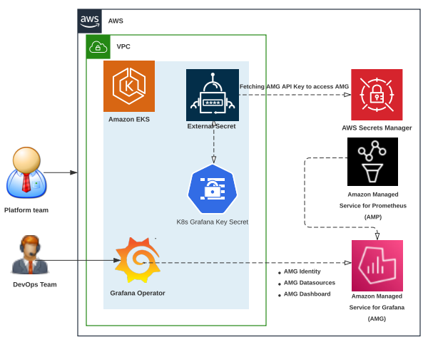
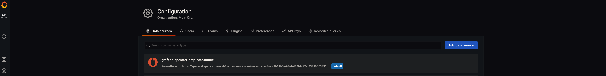
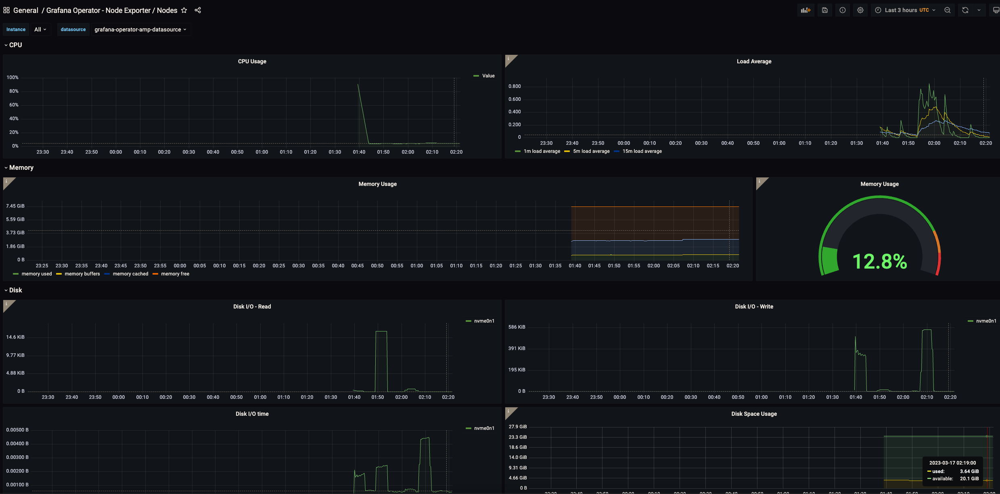

# Using Open Source Grafana Operator on your Kubernetes cluster to manage Amazon Managed Grafana

### Introduction

In this modern era, many customers running Kubernetes are moving towards the paradigm of leveraging Kubernetes as a control plane and rarely as a data plane. Their focus is shifted towards workload gravity and reliance on Kubernetes-native controllers to deploy and manage the lifecycle of external resources such as Cloud resources. We have seen customers installing [Crossplane](https://www.crossplane.io/) and [AWS Controllers for Kubernetes (ACK)](https://aws-controllers-k8s.github.io/community/docs/community/overview/)to create, deploy and manage AWS services. Many customers these days opt to offload the Prometheus and Grafana implementations to managed services and in case of AWS these services are [Amazon Managed Service for Prometheus](https://docs.aws.amazon.com/prometheus/?icmpid=docs_homepage_mgmtgov) (AMP) and [Amazon Managed Grafana](https://docs.aws.amazon.com/grafana/?icmpid=docs_homepage_mgmtgov) (AMG) for monitoring their workloads. Fundamentally what they need is one single API - the Kubernetes API, to control heterogeneous deployments.

Though customers look for ways to offload and manage their Grafana implementations to managed services such as AMG, there is no mechanism to achieve this. The [grafana-operator](https://github.com/grafana-operator/grafana-operator#:~:text=The%20grafana%2Doperator%20is%20a,an%20easy%20and%20scalable%20way.)is a Kubernetes operator built to help you manage your Grafana instances inside Kubernetes. Grafana Operator makes it possible for you to manage and create Grafana dashboards, datasources etc. declaratively between multiple instances in an easy and scalable way. Though Grafana Operator makes it possible to manage Grafana instances using code in a Kubernetes native way, there was no mechanism to intergrate Grafana services deployed outside of the cluster, such as AMG. 

To address this gap, AWS team collaborated with the [grafana-operator](https://github.com/grafana-operator/grafana-operator#:~:text=The%20grafana%2Doperator%20is%20a,an%20easy%20and%20scalable%20way.)team and submitted a [design proposal](https://github.com/grafana-operator/grafana-operator-experimental/pull/39)to support the integration of external Grafana instances. With this mechanism it will be possible to add external Prometheus compatible data sources (e.g., Amazon Managed Service for Prometheus) and create Grafana dashboards in external grafana instances (e.g., Amazon Managed Grafana) from your Kubernetes cluster. This enables us to use our Kubernetes cluster as a control plane to create Grafana implementations to Amazon Managed Grafana. Upon colloboration and consistently working through deployment stages with the Grafana Operator team (Kubernetes community), this feature is now fully supported in [release 5](https://github.com/grafana-operator/grafana-operator/releases/tag/v5.0.0-rc0) of Grafana Operator. This ultimately enables us to use GitOps mechanisms using CNCF projects such as [Flux](https://fluxcd.io/) and [Crossplane](https://docs.crossplane.io/latest) to create and manage the lifecyle of resources in AMG.

In this blog, we will be demonstrating on how to use Grafana Operator from your Kubernetes cluster to add an AMP data source and create dashboards in AMG in a Kubernetes native way.

### Solution Architecture



The architecture diagram shows the demonstration of Kubernetes cluster as a control plane with using Grafana Operator to setup an identity with AMG, adding AMP as a datasource and creating dashboards on AMG from Amazon EKS cluster in a Kubernetes native way.

### Solution Walkthrough

#### Prerequisites

You will need the following to complete the steps in this post:

* [AWS CLI version 2](https://docs.aws.amazon.com/cli/latest/userguide/install-cliv2.html)
* [AWS CDK](https://docs.aws.amazon.com/cdk/v2/guide/getting_started.html#getting_started_install) version 2.66.0 or later
* [Node](https://nodejs.org/en/download/current/) version 18.12.1 or later
* [NPM](https://docs.npmjs.com/downloading-and-installing-node-js-and-npm) version 8.19.2 or later
* [Kubectl](https://docs.aws.amazon.com/eks/latest/userguide/install-kubectl.html)
* [Git](https://git-scm.com/download)
* [jq](https://stedolan.github.io/jq/download/)
* [Helm](https://helm.sh/docs/intro/install/)
* [An existing Amazon Managed Grafana Workspace](https://aws.amazon.com/blogs/mt/amazon-managed-grafana-getting-started/)

Let’s start by setting a few environment variables:

```
export GO_ACCOUNT_ID=$(aws sts get-caller-identity --query 'Account' --output text)
export GO_AWS_REGION=us-west-2
export GO_CLUSTER_NAME="grafana-operator-cluster"
export GO_AMP_WORKSPACE_NAME="demo-amp-Workspace"
```

Clone the sample repository which contains the code for our solution :

```
git clone https://github.com/aws-samples/containers-blog-maelstrom.git
cd ./containers-blog-maelstrom/grafana-operator-AMG
```

#### Bootstrap the Environment

In this solution we will be using [Amazon EKS CDK Blueprints](https://github.com/aws-quickstart/cdk-eks-blueprints/tree/main/docs) to provision our Amazon EKS cluster. The first step to any [CDK](https://aws.amazon.com/cdk/) deployment is bootstrapping the environment. `cdk bootstrap` is a tool in the AWS CDK command-line interface ([AWS CLI)](https://docs.aws.amazon.com/cli/?id=docs_gateway) responsible for preparing the environment (i.e., a combination of AWS account and AWS Region) with resources required by CDK to perform deployments into that environment. If you already use [CDK](https://aws.amazon.com/cdk/) in a region, you don’t need to repeat the bootstrapping process. 

Lets run the below commands to bootstrap your environment and install all node dependencies required for deploying the solution:

```
npm install
`cdk bootstrap aws``:``//$GO_ACCOUNT_ID/$GO_AWS_REGION`
```

Next, lets try to grab the workspace if of any existing Amazon Managed Grafana workspace :

```
aws grafana list-workspaces

{
    "workspaces": [
        {
            "authentication": {
                "providers": [
                    "AWS_SSO"
                ]
            },
            "created": "2022-02-20T23:26:19.829000+00:00",
            "description": "Demo AMG Workspace",
            "endpoint": "g-XXXXXXXXXX.grafana-workspace.us-west-2.amazonaws.com",
            "grafanaVersion": "8.4",
            "id": "g-XXXXXXXX",
            "modified": "2022-02-20T23:26:19.829000+00:00",
            "name": "EKSA-Demo-AMG-Workspace",
            "notificationDestinations": [
                "SNS"
            ],
            "status": "ACTIVE",
            "tags": {}
        }
}

# populate the values from `id` and `endpoint` to below environment variable

export GO_AMG_WORKSPACE_ID="<<Your-WORKSPACE-ID>>"
export GO_AMG_WORKSPACE_URL="https://<<YOUR-WORKSPACE-URL>>
```

Next, lets create a grafana api key from your AMG workspace and setup a secret on AWS Secrets Manager which will be used to access from external secrets by our Amazon EKS cluster :

```
export GO_AMG_API_KEY=$(aws grafana create-workspace-api-key \
  --key-name "grafana-operator-key" \
  --key-role "ADMIN" \
  --seconds-to-live 432000 \
  --workspace-id $GO_AMG_WORKSPACE_ID \
  --query key \
  --output text)
  
export GO_API_KEY_SECRET_ARN=$(aws secretsmanager create-secret \
    --name grafana-api-key \
    --description "API Key of your Grafana Instance" \
    --secret-string $GO_AMG_API_KEY \
    --region $GO_AWS_REGION \
    --query ARN \
    --output text)
```

Please navigate to `bin/cluster-blueprint.ts` in the cloned repo to check on the [Amazon EKS CDK Blueprints](https://github.com/aws-quickstart/cdk-eks-blueprints/tree/main/docs) stack which will deploy EKS Cluster with day 2 operational [add-ons](https://aws-quickstart.github.io/cdk-eks-blueprints/addons/) required to run our solution. Please see the below `bin/cluster-blueprint.ts` snippet showing our EKS CDK Blueprints stack :

```
#!/usr/bin/env node

import 'source-map-support/register';
import * as cdk from 'aws-cdk-lib';
import * as blueprints from '@aws-quickstart/eks-blueprints';
import { GrafanaOperatorSecretAddon } from './grafanaoperatorsecretaddon';

const app = new cdk.App();

const account = process.env.GO_ACCOUNT_ID! || process.env.CDK_DEFAULT_ACCOUNT!;
const region = process.env.GO_AWS_REGION! || process.env.CDK_DEFAULT_REGION!;
const clusterName = process.env.GO_CLUSTER_NAME!;
const ampWorkspaceName = process.env.GO_AMP_WORKSPACE_NAME! || 'demo-amp-Workspace';

const addOns: Array<blueprints.ClusterAddOn> = [
    new blueprints.addons.AwsLoadBalancerControllerAddOn(),
    new blueprints.addons.VpcCniAddOn(),
    new blueprints.addons.CoreDnsAddOn(),
    new blueprints.addons.KubeProxyAddOn(),
    new blueprints.addons.CertManagerAddOn(),
    new blueprints.addons.ExternalsSecretsAddOn(),
    new blueprints.addons.PrometheusNodeExporterAddOn(),
    new blueprints.addons.KubeStateMetricsAddOn(),
    new blueprints.addons.AdotCollectorAddOn(),
    new blueprints.addons.AmpAddOn({
        workspaceName: ampWorkspaceName,
    }),
    new GrafanaOperatorSecretAddon(),
    
];

const stack = blueprints.EksBlueprint.builder()
    .account(account)
    .region(region)
    .addOns(...addOns)
    .build(app, clusterName);
```

Next, run the `cdk list` command which lists name of stack that will be created.

```
npm install
cdk list
```

If you are interested in knowing list of resources that will be created by this stack, you can view them using `cdk diff` command. 

#### Create the clusters and deploy the addons

Run below command to deploy the Amazon EKS cluster with day 2 operational [add-ons](https://aws-quickstart.github.io/cdk-eks-blueprints/addons/) required to run our solution. 

```
cdk deploy "*" --require-approval never
```

Deployment will take approximately 20-30 minutes to complete. Upon completion, you will have a fully functioning EKS cluster deployed in your account.

This blueprint will deploy the following:

* [Amazon Virtual Private Cloud (Amazon VPC)](https://aws.amazon.com/vpc/) with both Public and Private subnets
* An Amazon EKS cluster in the region and account you specify
* [Amazon VPC CNI](https://docs.aws.amazon.com/eks/latest/userguide/managing-vpc-cni.html) Add-on to your EKS cluster to support native VPC networking
* [External Secrets Addon](https://aws-quickstart.github.io/cdk-eks-blueprints/addons/external-secrets/) to integrate with AWS Secrets Manager to pull Amazon Managed Grafana api key.
* [CoreDNS Addon](https://aws-quickstart.github.io/cdk-eks-blueprints/addons/coredns/) is a flexible, extensible DNS server that can serve as the Kubernetes cluster DNS. 
* [CertManager Addon](https://github.com/aws-quickstart/cdk-eks-blueprints/blob/main/docs/addons/cert-manager.md) to install and manage the AWS Distro for OpenTelemetry (ADOT) Operator. 
* [KubeStateMetrics Addon](https://github.com/aws-quickstart/cdk-eks-blueprints/blob/main/docs/addons/kube-state-metrics.md) is a simple service that listens to the Kubernetes API server and generates metrics about the state of the objects.
* [PrometheusNodeExporter Addon](https://github.com/aws-quickstart/cdk-eks-blueprints/blob/main/docs/addons/prometheus-node-exporter.md) enables you to measure various machine resources such as memory, disk and CPU utilization.
* [Adot Addon](https://aws-quickstart.github.io/cdk-eks-blueprints/addons/adot-addon/) to install and manage the AWS Distro for OpenTelemetry (ADOT) Operator. 
* [Amp Adot Addon](https://aws-quickstart.github.io/cdk-eks-blueprints/addons/amp-addon/) deploys an AWS Distro for OpenTelemetry (ADOT) Collector for Amazon Managed Service for Prometheus (AMP) which receives transactional metrics from the application and Prometheus metrics scraped from pods on the cluster and remote writes the metrics to AMP remote write endpoint. This addon creates an AMP workspace with name `demo-amp-wokspace`. 
* Creates a [ClusterSecretStore](https://external-secrets.io/v0.5.9/api-clustersecretstore/) which can be used by all external secrets from all namespaces
* Creates an [ExternalSecret](https://external-secrets.io/v0.5.9/api-externalsecret/) which can be used to fetch, transform and inject secret data AMG API Key

Once the deployment is complete, you will see the below output in your terminal:

```
Outputs:
grafana-operator-cluster.grafanaoperatorclusterClusterName861294B8 = grafana-operator-cluster
grafana-operator-cluster.grafanaoperatorclusterConfigCommandDD46DC5D = aws eks update-kubeconfig --name grafana-operator-cluster --region us-west-2 --role-arn arn:aws:iam::940019131157:role/grafana-operator-cluster-grafanaoperatorclusterMas-3E4ITHRP3FRI
grafana-operator-cluster.grafanaoperatorclusterGetTokenCommand6228506B = aws eks get-token --cluster-name grafana-operator-cluster --region us-west-2 --role-arn arn:aws:iam::940019131157:role/grafana-operator-cluster-grafanaoperatorclusterMas-3E4ITHRP3FRI
Stack ARN:
arn:aws:cloudformation:us-west-2:940019131157:stack/grafana-operator-cluster/ee4f6ac0-c460-11ed-9e3a-022cbdd1a7dd
```

To update your Kubernetes config for you new cluster, copy and run the `aws eks update-kubeconfig...` command (the second command in the list above) in your terminal.

```
aws eks update-kubeconfig \
    --name $GO_CLUSTER_NAME \
    --region $GO_AWS_REGION \
    --role-arn arn:aws:iam::$GO_ACCOUNT_ID:role/grafana-operator-cluster-grafanaoperatorclusterMas-3E4ITHRP3FRI
```

Validate the access to your EKS cluster using below `kubectl` listing the secret created to access AMG workspace:

```
❯ k get secret                                                                                                                                                                     ─╯
NAME                        TYPE     DATA   AGE
grafana-admin-credentials   Opaque   1      2m59s
```

Lets also grab the endpoint URL of your created AMP workspace using the below commands :

```
export GO_AMP_WORKSPACE_ID=$(aws amp list-workspaces \
--alias 'demo-amp-Workspace' \
--query 'workspaces[].workspaceId' \
--output text)

export GO_AMP_ENDPOINT_URL="https://aps-workspaces.${GO_AWS_REGION}.amazonaws.com/workspaces/${GO_AMP_WORKSPACE_ID}"
```

#### Installing Grafana Operator

Next, lets install [Grafana Operator](https://github.com/grafana-operator/grafana-operator) on Amazon EKS to manage external Grafana instances such as Amazon Managed Grafana. The Grafana-operator will be used to create an AMP data source and dashboards on AMG using Kubernetes Custom Resource Definitions in a Kubernetes native way. Please use the below command to perform an Helm installation of Grafana Operator :

```
`>`` helm upgrade ``-``i grafana``-``operator`` oci``:``//ghcr.io/grafana-operator/helm-charts/grafana-operator --version v5.0.0-rc0

Release "grafana-operator" does not exist. Installing it now.
Pulled: ghcr.io/grafana-operator/helm-charts/grafana-operator:v5.0.0-rc0
Digest: sha256:12c28961333134da98890488c6ecfb2012bdf1900d76cf02b57b470cc7e70957
NAME: grafana-operator
LAST DEPLOYED: Fri Mar 17 02:06:56 2023
NAMESPACE: default
STATUS: deployed
REVISION: 1
TEST SUITE: None
`
```

Next, run the below command to status of Grafana Operator Helm installation :

```
> kubectl get all

NAME                                                READY   STATUS    RESTARTS   AGE
pod/grafana-operator-5cd6677459-56b4n               2/2     Running   0          14s
pod/otel-collector-amp-collector-59c7c9b4fb-c6qwz   1/1     Running   0          28m

NAME                                              TYPE        CLUSTER-IP      EXTERNAL-IP   PORT(S)    AGE
service/grafana-operator-metrics-service          ClusterIP   172.20.47.157   <none>        8443/TCP   15s
service/kubernetes                                ClusterIP   172.20.0.1      <none>        443/TCP    39m
service/otel-collector-amp-collector-monitoring   ClusterIP   172.20.30.253   <none>        8888/TCP   28m

NAME                                           READY   UP-TO-DATE   AVAILABLE   AGE
deployment.apps/grafana-operator               1/1     1            1           15s
deployment.apps/otel-collector-amp-collector   1/1     1            1           28m

NAME                                                      DESIRED   CURRENT   READY   AGE
replicaset.apps/grafana-operator-5cd6677459               1         1         1       16s
replicaset.apps/otel-collector-amp-collector-59c7c9b4fb   1         1         1       28m
```

#### Creating Amazon Managed Grafana Datasources and Dashboards using Grafana Operator:

Now, lets get to the fun part to creating an identity to Amazon Managed Grafana using the Grafana API Key from your Amazon EKS cluster. We will be using `grafanas.grafana.integreatly.org` CRD for this purpose as shown below:

```
`cat ``>`` amg_grafana``-``identity``.``json ``<<`` EOF`
apiVersion: grafana.integreatly.org/v1beta1
kind: Grafana
metadata:
  name: external-grafana
  labels:
    dashboards: "external-grafana"
spec:
  external:
    url: $GO_AMG_WORKSPACE_URL
    apiKey:
      name: grafana-admin-credentials
      key: GF_SECURITY_ADMIN_APIKEY
EOF
kubectl apply -f amg_grafana-identity.yaml
```

Lets check if an identity to Amazon Managed Grafana is created fine using below command :

```
❯ kubectl get grafanas.grafana.integreatly.org  
                                                                                                                                   ─╯
NAME               AGE
external-grafana   32s
```

Next, lets create Amazon Managed Service for Prometheus as a datasource to AMG from your Amazon EKS cluster. We will be using `grafanadatasources.grafana.integreatly.org` CRD for this purpose as shown below:

```
cat > amg_grafana-amp-datasource.json << EOF
apiVersion: grafana.integreatly.org/v1beta1
kind: GrafanaDatasource
metadata:
  name: grafanadatasource-sample-amp
spec:
  instanceSelector:
    matchLabels:
      dashboards: "external-grafana"
  datasource:
    name: grafana-operator-amp-datasource
    type: prometheus
    access: proxy
    url: $GO_AMP_ENDPOINT_URL
    isDefault: true
    jsonData:
      'tlsSkipVerify': false
      'timeInterval': "5s"
      'sigV4Auth': true
      'sigV4AuthType': "ec2_iam_role"
      'sigV4Region': $GO_AWS_REGION
    editable: true 
EOF
kubectl apply -f amg_grafana-amp-datasource.yaml
```

Lets check if Amazon Managed Service for Prometheus is created as a datasource to AMG from your Amazon EKS cluster using below commands :

```
❯ kubectl get grafanadatasources.grafana.integreatly.org                                                                                                                                 ─╯

NAME                           AGE
grafanadatasource-sample-amp   2m26s
```

```
❯ kubectl logs grafana-operator-5cd6677459-56b4n --tail=5
                                                                                                                                ─╯
Defaulted container "grafana-operator" out of: grafana-operator, kube-rbac-proxy
1.6790188337222888e+09    INFO    dashboard sync complete
1.6790188337222807e+09    INFO    datasources sync complete
1.6790188337222986e+09    INFO    folder sync complete
1.679019065074347e+09    INFO    found matching Grafana instances for datasource    {"controller": "grafanadatasource", "controllerGroup": "grafana.integreatly.org", "controllerKind": "GrafanaDatasource", "GrafanaDatasource": {"name":"grafanadatasource-sample-amp","namespace":"default"}, "namespace": "default", "name": "grafanadatasource-sample-amp", "reconcileID": "0e565db4-b332-4dbd-9181-429c9eefd0ab", "count": 1}
1.6790190652982466e+09    INFO    found matching Grafana instances for datasource    {"controller": "grafanadatasource", "controllerGroup": "grafana.integreatly.org", "controllerKind": "GrafanaDatasource", "GrafanaDatasource": {"name":"grafanadatasource-sample-amp","namespace":"default"}, "namespace": "default", "name": "grafanadatasource-sample-amp", "reconcileID": "eb24f960-d026-4181-9b96-b7609146c524", "count": 1}
```

Please check on [grafana-operator-manifests](https://github.com/aws-samples/containers-blog-maelstrom/tree/main/grafana-operator-AMG/grafana-operator-manifests) if your looking for samples to Amazon CloudWatch and AWS X-Ray as a datasource to AMG from your Amazon EKS Cluster.

Next lets navigate to AMG console and click on `Configuration` → `Data Sources` and click on the data source `grafana-operator-amp-datasource` as shown below :

 

Next, lets click on `Save and Test` as shown to make sure the data source is working fine.


Finally lets create a Grafana Dashboard on AMG from your Amazon EKS Cluster. We will be using `grafanadashboards.grafana.integreatly.org` CRD for this purpose as shown below :

```
cat > amg_grafana-dashboard.json << EOF
apiVersion: grafana.integreatly.org/v1beta1
kind: GrafanaDashboard
metadata:
  name: external-grafanadashboard-url
spec:
  instanceSelector:
    matchLabels:
      dashboards: "external-grafana"
  url: "https://raw.githubusercontent.com/aws-samples/containers-blog-maelstrom/main/grafana-operator-AMG/dashboards/nodeexporter-nodes.json"
EOF
kubectl apply -f amg_grafana-dashboard.yaml
```

Lets now check if Grafana Dashboard on AMG is created from your Amazon EKS Cluster using below command :

```
❯ kubectl get grafanadashboards.grafana.integreatly.org    
                                                                                                                              ─╯
NAME                            AGE
external-grafanadashboard-url   36s
```

```
❯ kubectl logs grafana-operator-5cd6677459-56b4n --tail=5                             
                                                                                                   ─╯
Defaulted container "grafana-operator" out of: grafana-operator, kube-rbac-proxy
1.679019065074347e+09    INFO    found matching Grafana instances for datasource    {"controller": "grafanadatasource", "controllerGroup": "grafana.integreatly.org", "controllerKind": "GrafanaDatasource", "GrafanaDatasource": {"name":"grafanadatasource-sample-amp","namespace":"default"}, "namespace": "default", "name": "grafanadatasource-sample-amp", "reconcileID": "0e565db4-b332-4dbd-9181-429c9eefd0ab", "count": 1}
1.6790190652982466e+09    INFO    found matching Grafana instances for datasource    {"controller": "grafanadatasource", "controllerGroup": "grafana.integreatly.org", "controllerKind": "GrafanaDatasource", "GrafanaDatasource": {"name":"grafanadatasource-sample-amp","namespace":"default"}, "namespace": "default", "name": "grafanadatasource-sample-amp", "reconcileID": "eb24f960-d026-4181-9b96-b7609146c524", "count": 1}
1.6790193653035195e+09    INFO    found matching Grafana instances for datasource    {"controller": "grafanadatasource", "controllerGroup": "grafana.integreatly.org", "controllerKind": "GrafanaDatasource", "GrafanaDatasource": {"name":"grafanadatasource-sample-amp","namespace":"default"}, "namespace": "default", "name": "grafanadatasource-sample-amp", "reconcileID": "f427a451-3400-4649-b662-8dba25866641", "count": 1}
1.6790195211297286e+09    INFO    found matching Grafana instances for dashboard    {"controller": "grafanadashboard", "controllerGroup": "grafana.integreatly.org", "controllerKind": "GrafanaDashboard", "GrafanaDashboard": {"name":"external-grafanadashboard-url","namespace":"default"}, "namespace": "default", "name": "external-grafanadashboard-url", "reconcileID": "f9dcb08c-58ea-49a4-a3ad-7a9ced94d093", "count": 1}
1.679019521481265e+09    INFO    found matching Grafana instances for dashboard    {"controller": "grafanadashboard", "controllerGroup": "grafana.integreatly.org", "controllerKind": "GrafanaDashboard", "GrafanaDashboard": {"name":"external-grafanadashboard-url","namespace":"default"}, "namespace": "default", "name": "external-grafanadashboard-url", "reconcileID": "0ff702f2-4332-4516-aef6-3da20fa80cc6", "count": 1}
```

Finally lets navigate to AMG console, click on `Search Dashboards` and you will be able to see a Dashboard by name `Grafana Operator - Node Exporter/Nodes` and click on the same will show you the Grafana Dashboard created out of the box having all the metrics from Prometheus Node Exporter installed on your Amazon EKS Cluster.



### GitOps Approach with Grafana Operator

GitOps is a way of managing application and infrastructure deployment so that the whole system is described declaratively in a Git repository. It is an operational model that offers you the ability to manage the state of multiple Kubernetes clusters leveraging the best practices of version control, immutable artifacts, and automation. [Flux](https://fluxcd.io/) is a declarative, GitOps-based continuous delivery tool that can be integrated into any CI/CD pipeline. It gives users the flexibility of choosing their Git provider (GitHub, GitLab, BitBucket). [Crossplane](https://docs.crossplane.io/latest) is an open-source Kubernetes add-on that enables platform teams to assemble cloud infrastructure resources, without having to write any code. Now, with [grafana-operator](https://github.com/grafana-operator/grafana-operator#:~:text=The%20grafana%2Doperator%20is%20a,an%20easy%20and%20scalable%20way.)supporting the management of external Grafana instances such as Amazon Managed Grafana, operations personas can use GitOps mechanisms using CNCF projects such as Flux and Crossplane to create and manage the lifecyle of resources in Amazon Managed Grafana.

### Cleanup

You continue to incur cost until deleting the infrastructure that you created for this post. Use the commands below to delete resources created during this post:

```
kubectl delete -f amg_grafana-dashboard.yaml
kubectl delete -f amg_grafana-amp-datasource.yaml
kubectl delete -f amg_grafana-identity.yaml
helm delete grafana-operator
aws secretsmanager delete-secret \
    --secret-id $GO_API_KEY_SECRET_ARN \
    --recovery-window-in-days 7
aws grafana delete-workspace-api-key \
  --key-name "grafana-operator-key" \
  `--``workspace``-``id $GO_AMG_WORKSPACE_ID`
`cdk destroy ``"*"`
```

CDK will ask you `Are you sure you want to delete: grafana-operator-cluster (y/n)?` and enter `y` to delete.

### Conclusion

In this blog, we started talking about how organizations are leverage kubernetes as a control plane to create and manage Grafana implementations to managed services such as Amazon Managed Grafana. Further, we demonstrated on how to use Grafana Operator from your Kubernetes cluster to data sources such as Amazon Managed Service for Prometheus and create Grafana dashboards to external grafana instances such as Amazon Managed Grafana in a Kubernetes native way. We would high encourage to try this solution and also leverage GitOps mechanisms with Grafana Operator using CNCF projects such as [Flux](https://fluxcd.io/) and [Crossplane](https://docs.crossplane.io/latest) to create and manage the lifecyle of resources in Amazon Managed Grafana.

For more information, see the following references:

* [Grafana Operator](https://grafana-operator.github.io/grafana-operator/)
* [Kubernetes as a platform vs. Kubernetes as an API](https://aws.amazon.com/blogs/containers/kubernetes-as-a-platform-vs-kubernetes-as-an-api-2/)
* [Amazon EKS Blueprints](https://aws-quickstart.github.io/cdk-eks-blueprints/)
* [Amazon EKS Blueprints Patterns](https://github.com/aws-samples/cdk-eks-blueprints-patterns)
* [GitOps model for provisioning and bootstrapping Amazon EKS clusters using Crossplane and Flux](https://aws.amazon.com/blogs/containers/gitops-model-for-provisioning-and-bootstrapping-amazon-eks-clusters-using-crossplane-and-flux/)

## Authors


### Elamaran Shanmugam

Elamaran (Ela) Shanmugam is a Sr. Container Specialist Solutions Architect with Amazon Web Services. Ela is a Container, Observability and Multi-Account Architecture SME and helps AWS partners and customers to design and build scalable, secure and optimized container workloads on AWS. His passion is building and automating Infrastructure to allow customers to focus more on their business. He is based out of Tampa, Florida and you can reach him on twitter @IamElaShan


### Mikhail Shapirov

Mikhail is a Principal Partner Solutions Architect at AWS, focusing on container services. Mikhail helps partners and customers drive their products and services on AWS, integrating with Amazon ECS, EKS and AppMesh. He is also a software engineer.


### **Edvin Norling**

Edvin Norling is a Platform Engineer at Kognic and creates a golden path for hes developers using Kubernetes and surrounding projects. Edvin is the maintainer of the grafana-opertor which is a Kubernetes operator to manage Grafana instances. He is based out of Gothenburg Sweden and you can reach him on Kubernetes slack [@Edvin N](https://kubernetes.slack.com/team/UD1QJL38Q)
