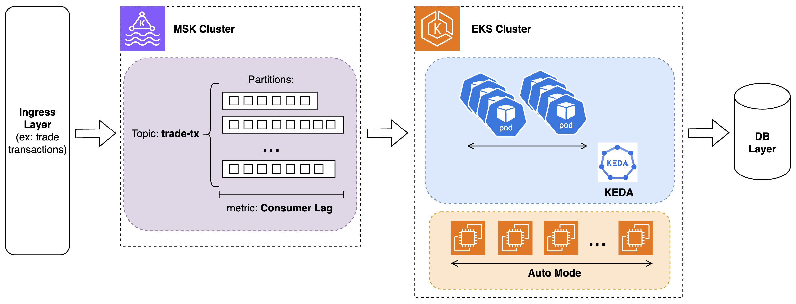
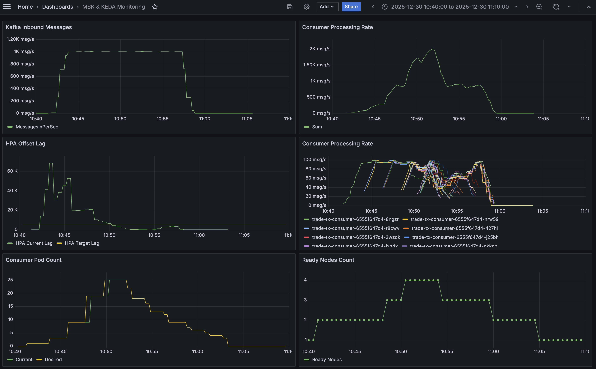

# MSK EKS Microbatch Processing with Keda - Demo

## Introduction

This architecture demonstrates how to process variable transaction volumes with speed and cost efficiency. 

The solution combines **AWS MSK** (managed Kafka) for durable message streaming with **Amazon EKS** and **KEDA** for event-driven autoscaling. It delivers:

- **Massive parallelization** across Kafka partitions for high throughput
- **Sub-minute scaling** from 0 to 20+ consumer pods based on real-time lag
- **Message persistence and replay** for audit/compliance requirements
- **Ordering guarantees** via Kafka partition keys when needed
- **Multi-tenant isolation** for service providers managing multiple institutions
- **Managed services** (MSK, EKS) to reduce operational overhead
- **Built-in security** with IAM authentication and encryption

## Architecture Components



- **AWS MSK**: Managed Kafka cluster with IAM authentication and 24 partitions for parallelization
- **Amazon EKS**: Kubernetes cluster with automatic compute management
- **KEDA**: Event-driven autoscaler monitoring Kafka consumer lag (scales 0-20 replicas)
- **Consumer Application**: Microbatch processor with cooperative rebalancing for zero-downtime scaling
- **Producer Simulator**: Generates variable transaction loads to demonstrate elasticity
- **Prometheus + Grafana**: Observability stack for metrics and dashboards

## Tuning Autoscaling Behavior

Scaling responsiveness is configured in the KEDA ScaledObject YAML. The key challenge is balancing **reaction speed** vs **stability**:

- **Too reactive**: System becomes unstable, flapping up and down
- **Too slow**: Messages accumulate in Kafka, increasing processing delays

Multiple factors add to scaling instability such as Kafka partition rebalancing when pods join or leave the consumer group, traffic variability, etc. Extra care should be taken to smooth out scaling and avoid a flapping system.

**Critical tuning steps:**

1. **Optimize partition rebalancing** by using cooperative rebalancing in the consumer app. During scale events, Kafka redistributes partition assignments across pods. With default "eager" rebalancing, all consumers pause for 30-60 seconds—violating SLAs during critical moments. This demo uses **cooperative rebalancing**, allowing most pods to continue processing while only affected pods pause briefly, ensuring consistent throughput during scaling.

2. **Profile your application** to identify:
   - Peak processing capacity per pod (~100 msg/s in this demo)
   - Ramp-up time to reach peak capacity (~60 seconds)
   - Time it takes for partition rebalance to complete and consumers to pick up processing speed again (~60 seconds)

3. **Tune timing settings**:
   Consider multiple configuration options for influencing scaling sensitivity:
   - **Pod initialReadinessDelay**: Allow time for new pods to ramp up before HPA considers them ready
   - **StabilizationWindowSeconds**: Consider metric values using a rolling window to smooth out fluctuations
   - **Scaling policy periodSeconds**: Define an upper budget for scaling and wait for a period of time to scale again after the budget is consumed

## Deployment Steps

### Prerequisites

- AWS CLI configured with appropriate credentials
- Docker installed and running
- Terraform >= 1.3
- kubectl
- jq

### Step 1: Deploy Infrastructure

Deploy the underlying infrastructure using Terraform:

```bash
./deploy-infra.sh
```

This creates:
- **VPC** with public/private subnets across 2 AZs
- **MSK cluster** with 2 brokers, 24 partitions, IAM authentication
- **EKS cluster** with Auto Mode for managed compute
- **IAM roles and policies** for Pod Identity (producer, consumer, KEDA)
- **Prometheus + Grafana** for observability (in cluster kube-prometheus-stack)
- **KEDA operator** for event-driven autoscaling

**Verify MSK bootstrap servers were added to .env:**
```bash
grep "KAFKA_BOOTSTRAP_SERVERS" .env
```

### Step 2: Deploy Consumer Application

```bash
./deploy-consumer.sh
```

This deploys:
- **Consumer Deployment**: Kubernetes deployment running the transaction processor
  - Registers as consumer group `trade-tx-consumer` with MSK
  - Polls messages from topic `trade-tx`
  - Uses **microbatching** to aggregate records before processing (configurable `BATCH_SIZE`)
  - Simulates batch DB writes by waiting `BATCH_PROCESSING_TIME` for each batch
  - Implements **cooperative rebalancing** to minimize processing interruption during scale events

- **KEDA ScaledObject**: Configures autoscaling behavior
  - Monitors `OffsetLag` metric (pending messages per partition)
  - Scales from **0 to 100 replicas** based on lag threshold (configurable `LAG_THRESHOLD = 5000`)
  - When lag > 5000: KEDA scales up pods to meet demand
  - When lag < 5000: KEDA scales down to save resources
  - When lag = 0: KEDA scales to zero after cooldown period

**Microbatching benefits**: Aggregating multiple records into a single DB operation significantly reduces write latency—the typical bottleneck in transaction processing.

### Step 3: Deploy Producer (Low Load)

Deploy the producer with initial low load:

```bash
./deploy-producer.sh 10
```

This creates a Kubernetes deployment generating simulated trade transactions at **~10 messages/second**. In production, this would be replaced by an ingress layer managing client connections.

**Check producer logs:**
```bash
kubectl wait --for=condition=ready pod -l app=trade-tx-producer --timeout=60s
sleep 5
kubectl logs -l app=trade-tx-producer
```

Expected output:
```
pod/trade-tx-producer-85f45bfd5f-8kcxd condition met
[2025-12-30 16:12:06] INFO: Creating producer with bootstrap_servers: b-1.mskdemocluster.33uj55.c5.kafka.us-east-1.amazonaws.com:9098,b-2.mskdemocluster.33uj55.c5.kafka.us-east-1.amazonaws.com:9098
[2025-12-30 16:12:06] INFO: Starting continuous producer: 10 messages/second
[2025-12-30 16:12:06] INFO: Target interval: 0.100000 seconds
[2025-12-30 16:12:11] INFO: Sent: 51 messages, Rate: 10.2 msg/s, Target: 10 msg/s
```

**Check consumer logs:**
```bash
kubectl wait --for=condition=ready pod -l app=trade-tx-consumer --timeout=60s
kubectl logs -l app=trade-tx-consumer
```

Expected output:
```
pod/trade-tx-consumer-bdb4ff757-gh2bd condition met
[2025-12-30 16:12:21] INFO: Batch size: 100, Batch timeout: 0.1s
[2025-12-30 16:12:21] INFO: Metrics available at :8000/metrics
[2025-12-30 16:12:25] INFO: Processing batch of 1 messages
[2025-12-30 16:12:26] INFO: Processing batch of 100 messages
```

**Monitor autoscaling:**
```bash
kubectl get hpa
```

At 10 msg/s, lag stays below the 1000-message threshold, so only **1 replica** runs:
```
NAME                                REFERENCE                      TARGETS       MINPODS   MAXPODS   REPLICAS   AGE
keda-hpa-trade-tx-consumer-scaler   Deployment/trade-tx-consumer   14/5k (avg)   1         100       1          32m
```

### Step 4: Simulate Demand Spike

Increase load to simulate a market event:

```bash
./deploy-producer.sh 1000
```

This increases message generation to **~1000 messages/second** (100x spike).

**Watch HPA scale out:**
```bash
watch kubectl get hpa
```

HPA scales up to meet demand after waiting for the configured stabilization windows and timing delays to smooth out scaling decisions.
```
NAME                                REFERENCE                      TARGETSMINP         MINPODS   MAXPODS   REPLICAS   AGE
keda-hpa-trade-tx-consumer-scaler   Deployment/trade-tx-consumer   3580813m/5k (avg)   1         100       16         37m
```

As consumers process the backlog, HPA gradually scales down to match demand:
```
NAME                                REFERENCE                      TARGETS             MINPODS   MAXPODS   REPLICAS   AGE
keda-hpa-trade-tx-consumer-scaler   Deployment/trade-tx-consumer   3038462m/5k (avg)   1         100       13         16m
```

### Step 5: Scale to Zero

Stop the producer to simulate zero load:

```bash
kubectl delete deployment -n default trade-tx-producer
```

Once the consumer pods process all remaining messages and lag reaches zero, KEDA waits for the cooldown period, then:
1. Deletes the HPA
2. Scales the deployment to **0 replicas**

This eliminates compute costs during idle periods while maintaining instant readiness to scale back up when new messages arrive.

## Monitoring

**Access Grafana dashboard:**
```bash
kubectl port-forward -n kube-system svc/kube-prometheus-stack-grafana 3000:80
```
Open http://localhost:3000 (default credentials: admin/prom-operator)

**Access provided dashboard:**
Title: "MSK & KEDA Monitoring"



## Configuration

Edit `.env` files in application directories:

**Producer (`trade-tx-producer/.env`):**
- `MESSAGES_PER_SECOND`: Message generation rate

**Consumer (`trade-tx-consumer/.env`):**
- `BATCH_SIZE`: Messages per microbatch
- `BATCH_PROCESSING_TIME`: Simulated DB write time in seconds

## Clean Up

```bash
cd infra-tf
terraform destroy
```

## Project Structure

```
.
├── deploy-infra.sh           # Deploy infrastructure
├── deploy-producer.sh        # Deploy producer
├── deploy-consumer.sh        # Deploy consumer
├── infra-tf/                 # Terraform configuration
├── trade-tx-producer/        # Producer application
└── trade-tx-consumer/        # Consumer application
```
