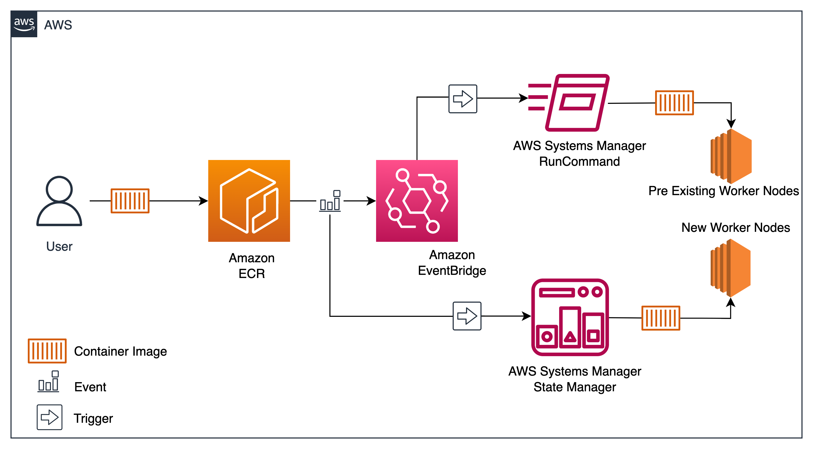
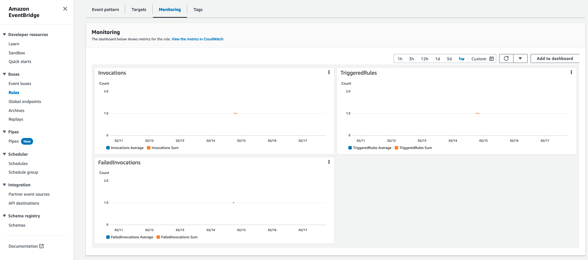
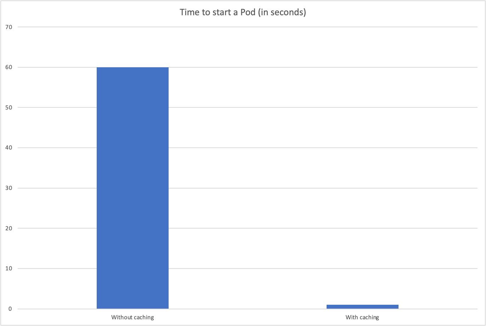

# Improve container startup time by caching images

Many AWS customers use Amazon EKS to run machine learning workloads. Containerization allows machine learning engineers to package and distribute models easily, while Kubernetes helps in deploying, scaling, and improving. When working with customers that run machine learning training jobs in Kubernetes, we have seen that as the data set and model size grows, so does the container image size, which results in slow containers startup. 

The slow container startup problem isn’t unique to machine learning and artificial intelligence. We have seen similar issues in build environments and data analytics workloads. The container images for these workloads include data, libraries, and dependencies. As a result, these images can vary from a few hundred MBs to tens of GBs. 

When images grow beyond a few hundred MBs, it can take several minutes to start a container. The primary reason for this slowness is that the container runtime has to pull the entire container image before the container can start. Kubernetes solves this problem by caching images on nodes. But that only reduces the startup time for subsequent containers. The first image pull remains a challenge.

Several community projects have attempted to tackle this issue by pre-fetching larger images. The idea is to pull the image on nodes before a Pod gets scheduled. These projects add another component that customers have to manage as they rely on DaemonSets and CronJobs to maintain a cached copy of large images. This post proposes a design that allows you to pre-pull images on nodes without managing infrastructure or Kubernetes resources. 


## EKS data plane management with AWS Systems Manager

AWS Systems Manager (https://aws.amazon.com/systems-manager/) is a secure end-to-end management solution for AWS resources. It offers a suite of operational management tools to simplify the management of AWS resources, automate operational tasks, and streamline IT operations at scale.

With AWS Systems Manager, you can securely manage instances, automate patching and software installations, monitor and collect operational data, and enable remote access to instances, making it an essential tool for efficiently managing your AWS infrastructure. You can use AWS Systems Manager to customize nodes as they get created.

In this post we use AWS Systems Manager State Manager (https://docs.aws.amazon.com/systems-manager/latest/userguide/systems-manager-state.html) to cache container images on nodes. To keep the cache current, the solution uses an event-driven architecture to update the cache as new images get pushed to the image registry. By caching container images on nodes, we significantly reduce the container startup time. When containers get created, the container runtime doesn’t spend any time pulling the image from the container registry. As a result, horizontal scaling occurs almost immediately. 

## Solution  Overview

We’ll reduce Pod startup time by caching images for a sample application before a Pod gets scheduled on the node. The solution uses Amazon EventBridge (https://aws.amazon.com/eventbridge/) and AWS Systems Manager for the automation. Whenever we push a new image to the sample application’s Amazon Elastic Container Registry (https://aws.amazon.com/ecr/) (ECR) repository, AWS Systems Manager executes commands to pull the new image on all worker nodes. 

As new worker nodes start, AWS Systems Manager will run similar automation to pull the image. Below is the architecture diagram for setting up a Event Driven process to pre-fetch data to EKS Nodes using SSM Automation.



The process for implementing this solution is as follows:

* The first step is to identify the image repository to fetch the container image. The container image repository could be Amazon ECR, DockerHub, or others. 
* Next, when a container image gets pushed to Amazon ECR, an event based rule is triggered by Amazon EventBridge, which starts an AWS SSM automation to pre-fetch container images from Amazon ECR
* Whenever a new worker node gets added to your cluster, based on the tags on the worker node, AWS Systems Manager State Manager association (https://docs.aws.amazon.com/systems-manager/latest/userguide/systems-manager-associations.html) pre-fetches container images to new nodes

## Prerequisites

To run this solution, you must have the following prerequisites:

* [AWS CLI version 2.10 or higher] (https://docs.aws.amazon.com/cli/latest/userguide/install-cliv2.html) to interact with AWS services
* [eksctl] (https://docs.aws.amazon.com/eks/latest/userguide/eksctl.html) for creating and managing your Amazon EKS cluster
* [kubectl] (https://docs.aws.amazon.com/eks/latest/userguide/install-kubectl.html) for running kubectl commands on your Amazon EKS cluster
* [envsubst] (https://yum-info.contradodigital.com/view-package/base/gettext/) for environment variables substitution (envsubst is included in gettext package)
* [jq] (https://stedolan.github.io/jq/download/) for command-line JSON processing

## Solution Walkthrough

1. Checkout the source code, the source code for this blog is available in AWS-Samples on GitHub (https://github.com/aws-samples/containers-blog-maelstrom/tree/main/prefetch-data-to-EKSnodes).

      ```bash
      git clone https://github.com/aws-samples/containers-blog-maelstrom/
      cd containers-blog-maelstrom/prefetch-data-to-EKSnodes
      ```

2. Let’s start by setting environment variables:

      ```bash
      export EDP_AWS_REGION=us-east-1
      export EDP_AWS_ACCOUNT=$(aws sts get-caller-identity --query 'Account' --output text)
      export EDP_NAME=prefetching-data-automation
      ```

3. Create an Amazon EKS cluster:

      ```bash
      envsubst < cluster-config.yaml | eksctl create cluster -f -
      ```

4. Create Amazon Elastic Container Registry repository to store the sample application’s image:

      ```bash
      aws ecr create-repository \
          --cli-input-json file://repo.json  \
          --repository-name ${EDP_NAME} \
          --region $EDP_AWS_REGION
      ```
5. Create a large container image:

      ```bash
      ./build-docker-image.sh
      ```

6. Create an IAM role for Amazon EventBridge:

      ```bash
      aws iam create-role \
          --role-name $EDP_NAME-role \
          --assume-role-policy-document file://events-trust-policy.json
      ```

7. Attach a policy to the role that allows Amazon EventBridge to run commands on cluster’s worker nodes using AWS Systems Manager:

      ```bash
      aws iam put-role-policy \
          --role-name ${EDP_NAME}-role \
          --policy-name ${EDP_NAME}-policy \
          --policy-document "$(envsubst < events-policy.json)"
      ```

8. Create an Amazon EventBridge rule that looks for push events on the Amazon ECR repository:

      ```bash
      envsubst < events-rule.json > events-rule-updated.json 
      aws events put-rule \
        --cli-input-json file://events-rule-updated.json \
        --region $EDP_AWS_REGION
      rm events-rule-updated.json
      ```

9. Attach System Manager Run Command as the target. Whenever we push a new image to the ECR repository, Amazon EventBridge will trigger SSM run command to pull the new image on worker nodes. 

      ```bash
      envsubst '$EDP_AWS_REGION $EDP_AWS_ACCOUNT $EDP_NAME' < events-target.json > events-target-updated.json
      aws events put-targets --rule $EDP_NAME \
        --cli-input-json file://events-target-updated.json \
        --region $EDP_AWS_REGION
      rm events-target-updated.json 
      ```

10. Create an AWS Systems Manager State Manager (https://docs.aws.amazon.com/systems-manager/latest/userguide/systems-manager-associations.html) association to pre-fetch sample application’s images on new worker nodes:

      ```bash
      envsubst '$EDP_AWS_REGION $EDP_AWS_ACCOUNT $EDP_NAME' < \
        statemanager-association.json > statemanager-association-updated.json 
      aws ssm create-association --cli-input-json \
        file://statemanager-association-updated.json \
        --region $EDP_AWS_REGION
      rm statemanager-association-updated.json
      ```
      Note: The status of AWS SSM State Manager association will be in “failed” state until the first run. 

## Validation

We have laid the groundwork for the automation. Let’s validate the setup by pushing a new image to the repository. We’ll know the automation works if worker nodes pull the image before we schedule a Pod. 

### Test image pre-fetch on existing nodes

1. Log into the ECR repository:

      ```bash
      aws ecr get-login-password \
          --region $EDP_AWS_REGION | docker login \
          --username AWS \
          --password-stdin $EDP_AWS_ACCOUNT.dkr.ecr.$EDP_AWS_REGION.amazonaws.com
      ```

2. Push the container image we created earlier:

      ```bash
      docker push $EDP_AWS_ACCOUNT.dkr.ecr.$EDP_AWS_REGION.amazonaws.com/$EDP_NAME
      ```

3. As we push the image to Amazon ECR, ECR publishes an event to Amazon EventBridge. As a result, the rule we previously created in Amazon EventBridge will trigger AWS Systems Manager Run Command. 

    You can monitor rule invocation in the AWS Management Console. Navigate to Amazon EventBridge in AWS Management Console and switch to the *Monitoring* tab for the event. If you don’t see *FailedInvocations*, then EventBridge has delivered the event to AWS Systems Manager successfully.

    
    
    Note: It might take 3 to 5 mins for the data points to be published in the Monitoring graphs

4. Verify if AWS Systems Manager Run Command is triggered by Amazon EventBridge. Run the below command to see the invocations. Look for DocumentName which should be AWS-RunShellScript, RequestedDateTime to identify 
   corresponding run, and then status to make sure if the Run Command executed Successfully or not.

      ```bash
      aws ssm list-command-invocations \
          --details \
          --filter "[{\"key\": \"DocumentName\", \"value\": \"arn:aws:ssm:${EDP_AWS_REGION}::document/AWS-RunShellScript\"}]" \
          --region $EDP_AWS_REGION
      ```

      **Output**

      ```bash
      {
          "CommandInvocations": [
              {
                  "CommandId": "eeb9d869-421d-488f-b1ba-ce93a69db2b0",
                  "InstanceId": "i-0e1a4977c389*****",
                  "InstanceName": "ip-192-168-29-214.ec2.internal",
                  "Comment": "",
                  "DocumentName": "arn:aws:ssm:us-east-1::document/AWS-RunShellScript",
                  "DocumentVersion": "$DEFAULT",
                  "RequestedDateTime": "2023-02-17T17:35:48.520000-06:00",
                  "Status": "Success",
                  "StatusDetails": "Success",
                  .......
                  .......
      ```

5. Verify that the worker node has pulled the image. We’ll SSM agent to log into the worker node:

      ```bash
      aws ec2 describe-instances \
          --filters "Name=tag:eks:cluster-name,Values=$EDP_NAME" "Name=tag:eks:nodegroup-name,Values=nodegroup" \
          --query "Reservations[*].Instances[*].InstanceId" \
          --output text \
          --region $EDP_AWS_REGION | xargs -I {} aws ssm start-session \
          --target {} \
          --document-name AWS-StartInteractiveCommand \
          --parameters "command=echo \$(curl -s http://169.254.169.254/latest/meta-data/instance-id) && sudo ctr -n k8s.io images ls | grep ${EDP_NAME}" \
          --region $EDP_AWS_REGION
      ```

      **Output**

      ```bash
      Starting session with SessionId: i-084630900d41ea7bf-0412132f6a6ec65b0
      i-051edb69ee3c4de4e
      0123456789.dkr.ecr.us-east-2.amazonaws.com/prefetching-data-automation:latest  application/vnd.docker.distribution.manifest.v2+json    sha256:eb0703bef7c8312b517495a9f2d0cc41384b6fdd66b2dc10d266e0032613fb63 1.1 GiB   linux/amd64   io.cri-containerd.image=managed
      ```

      Note: If you receive Cannot perform start session: EOF error, try to rerun the command. This error is caused by an issue with Amazon Systems Manager SSM agent (https://github.com/aws/amazon-ssm-agent/issues/354).

### Test image pre-fetch on new nodes

We have verified that existing nodes are pulling new image as soon as a new version gets pushed. Let’s validate that the automation also pulls the latest version of image (not to be confused with the $latest tag) on any new nodes that join the cluster. 

1. To test the process, let’s create a new node by increasing the size of the existing node group:

      ```bash
      eksctl scale nodegroup \
        --cluster $EDP_NAME \
        --name nodegroup \
        --nodes 2 \
        --nodes-min 1 \
        --nodes-max 3 \
        --region $EDP_AWS_REGION
      ```

2. Once the new node becomes available, verify if the image has been cached on it:

      ```bash
      aws ec2 describe-instances \
          --filters "Name=tag:eks:cluster-name,Values=$EDP_NAME" "Name=tag:eks:nodegroup-name,Values=nodegroup" \
          --query "Reservations[*].Instances[*].InstanceId" \
          --output text \
          --region $EDP_AWS_REGION | xargs -I {} aws ssm start-session \
          --target {} \
          --document-name AWS-StartInteractiveCommand \
          --parameters "command=echo \$(curl -s http://169.254.169.254/latest/meta-data/instance-id) && sudo ctr -n k8s.io images ls | grep ${EDP_NAME}" \
          --region $EDP_AWS_REGION
      ```

      **Output**

      ```bash
      Starting session with SessionId: i-084630900d41ea7bf-0412132f6a6ec65b0
      i-051edb69ee3c4df2f
      0123456789.dkr.ecr.us-east-2.amazonaws.com/prefetching-data-automation:latest    application/vnd.docker.distribution.manifest.v2+json    sha256:eb0703bef7c8312b517495a9f2d0cc41384b6fdd66b2dc10d266e0032613fb63 1.1 GiB   linux/amd64   io.cri-containerd.image=managed
      ```

### Container startup improvement

By pre-fetching the image, we have reduced container startup time significantly. When a node doesn’t have a cached copy of the image, it has to download the entire image before the container can start. 

As an example, it takes sixty seconds to start a container using the 1 GB test image we’ve used in this post. The same container starts in one second when the node has a cached copy of the image. 



## Design considerations

The solution is design to cache images but it doesn’t clean old images. It relies on Kubelet’s garbage collection (https://kubernetes.io/docs/concepts/architecture/garbage-collection/) to remove unused images. The kubelet automatically removes unused images when the root volume on a nodes is nearing 

Pre-fetching images can fill node’s local storage. Limit the number of images you cache to avoid running into storage capacity issues. 

This solution also assumes that the image pull occurs before a Pod gets scheduled on the node. If the Pod is scheduled before the image is cached, the node will have to pull the image from the container registry, thus rendering this technique ineffective. Customers can use overprovisioning (https://aws.github.io/aws-eks-best-practices/cluster-autoscaling/#overprovisioning) to ensure that the automation runs before a Pod gets scheduled on new  nodes. 

## Cleanup

You continue to incur cost until deleting the infrastructure that you created for this post. Use the commands below to delete resources created during this post:

./cleanup.sh

## Lazy loading container images

Lazy loading is an approach where data is downloaded from the registry in parallel with the application startup. Seekable OCI (SOCI) (https://github.com/awslabs/soci-snapshotter) is a technology open sourced by AWS that enables containers to launch faster by lazily loading the container image. 

To use lazy loading, customers have to build a SOCI index of the container image, which adds an additional step to the container build process. Customers that have control over their build process can also consider using SOCI to improve container start up time

## Conclusion

By utilizing AWS Systems Manager SSM to pre-fetch container images on worker nodes in your Amazon EKS Cluster, you can significantly reduce Pod startup times, even for large images, down to a few seconds. This technique can greatly benefit customers running workloads such as machine learning, simulation, data analytics, and code builds, improving container startup performance and overall workload efficiency. By eliminating the need for additional management of infrastructure or Kubernetes resources, this approach offers a cost-efficient and serverless solution for addressing the slow container startup problem in Kubernetes-based environments.