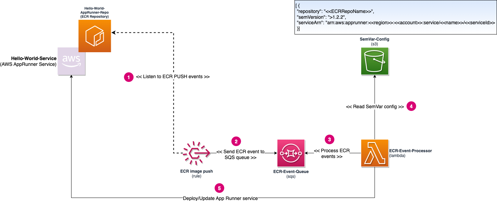
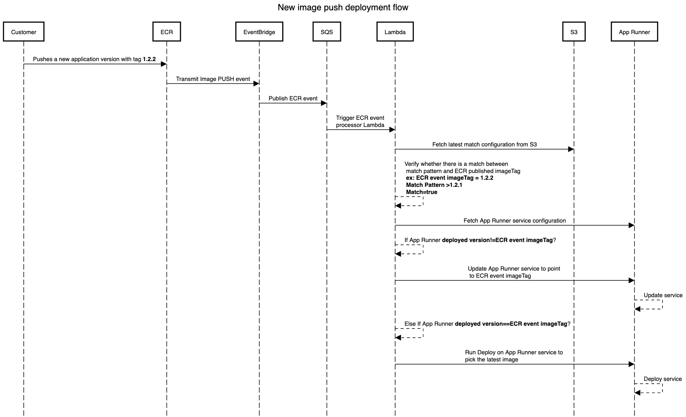
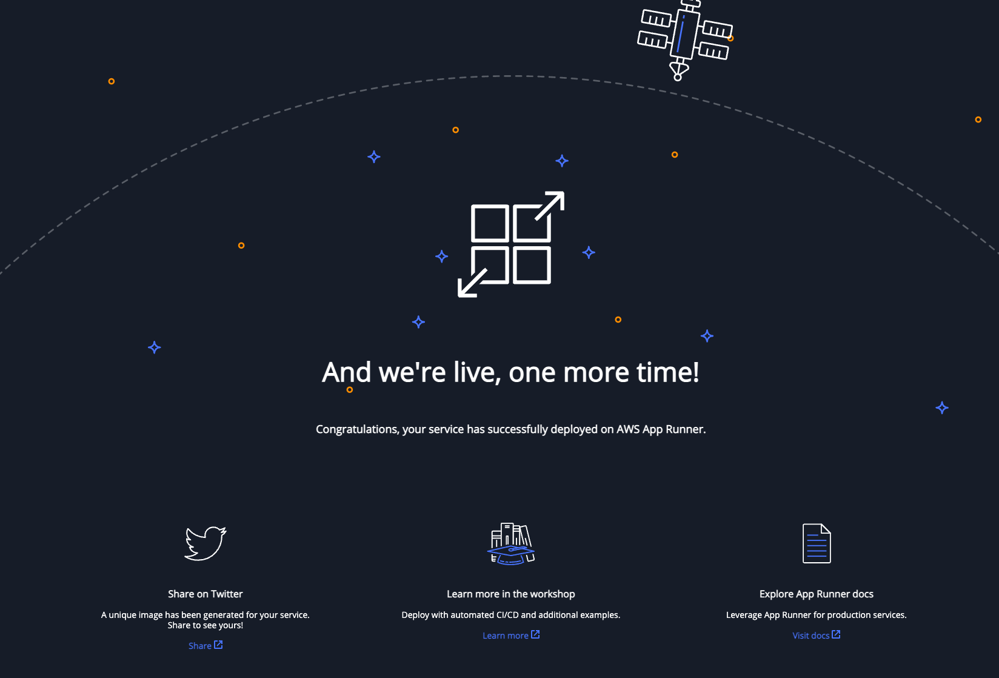

# Enable continuous deployment based on semantic versioning using AWS App Runner

## Introduction

In this modern cloud era, customers automatically build, test, and deploy the new version of their application multiple times a day, and this is a common scenario in the software development life cycle as it allows for faster delivery of features, bug fixes, and other updates to end users. One key aspect of continuous deployment is semantic versioning, a system for assigning version numbers to software releases. Semantic versioning uses a standard format to convey the level of change in a release, allowing developers and users to understand the potential impact of an update. 

In this blog post, we will show you how to use semantic versioning combined with the CI/CD capabilities App Runner provides to deploy new versions of the application automatically.

## Semantic Versioning

Semantic versioning is a system for assigning version numbers to software releases. It uses a standard format to convey the level of change in a release, allowing developers and users to understand the potential impact of an update. The basic format of a semantic version number is `MAJOR.MINOR.PATCH`, where each component is a non-negative integer.


Here are some general rules for semantic versioning:
* When a release contains backward-incompatible changes, the MAJOR version is incremented. 
* When a release contains backward-compatible changes, the MINOR version is incremented. 
* PATCH version is incremented for releases that contain only bug fixes and no other changes. 

By using semantic versioning, developers can communicate the impact of a release to users, making it easier to understand the risks and benefits of updating to a new version. It also helps organizations to adopt a more predictable and consistent approach to versioning and releasing their software. Semantic versioning is not a replacement for a changelog or release notes. It is a way to convey the impact of a release, but it does not provide any information about the changes made.

## Problem Statement

AWS App Runner is a fully managed container application service that makes it easy to deploy containerized applications from source code repositories quickly. App Runner provides a fully controlled environment to build, run, and scale containerized applications. It also provides a fully managed CI/CD pipeline to build and deploy new application versions automatically. Customers can leverage App Runner to continuously monitor their ECR repository for new images based on a fixed tag (like `LATEST`) and automatically deploy the new version of the application to the underlying App Runner service. 

However, this approach does not allow customers to monitor and deploy the new version of the application based on semantic versioning. Let's say the customer wants App Runner to automatically deploy the new application version based on a match pattern like `>= MAJOR1.MINOR2.PATCH3`, this is not possible with the current App Runner capabilities. 

## Customer Benefits

Here are some of the benefits of using the solution outlined in this post:

* Customers can use semantic versioning to communicate the impact of a release to users, making it easier to understand the risks and benefits of updating to a new version.
* Customers can use App Runner to automatically deploy new versions of the application based on semantic versioning.
* Customers can use unique tags (based on build ID, git commit) for each version of the application, making tracking and managing the application versions easier.
* With this approach, customers can start following the best practices in versioning and releasing their software. Yet, they can still leverage App Runner to roll out these changes to their end users without worrying about the underlying infrastructure.
* The solution outlined in this post is scalable and can deploy multiple applications without additional cost.

---

## Solution Overview

In this solution we use the following AWS services:
* AWS App Runner - Fully managed container application service that makes it easy to quickly deploy containerized applications from source code repositories.
* AWS Lambda - Serverless compute service that allows you to run code without provisioning or managing servers.
* AWS ECR - Fully managed Docker container registry that makes it easy for developers to store, manage, and deploy Docker container images.
* AWS EventBridge - Fully managed event bus that makes it easy to connect applications together using data from your own applications, Software-as-a-Service (SaaS) applications, and AWS services.
* AWS S3 - Fully managed object storage service that offers industry-leading scalability, data availability, security, and performance.

The following diagram shows the overall architecture of the solution:



The solution uses Event bridge rules to listen to the ECR `PUSH` events, which get processed by a Lambda function via an SQS queue. The lambda function uses AWS App Runner APIs to fetch the currently deployed version of the application and compare it with the `imageTag` that got pushed to the ECR repository. If there is a match (based on semantic versioning), the Lambda function updates the App Runner service to deploy the new version of the application. Customers can provide the match pattern as an input parameter to the Lambda function in the form of a JSON file (sample below) stored in an S3 bucket.

```json
[
  {
    "repository": "Hello-World-AppRunner-Repo",
    "semVersion": ">1.2.3",
    "serviceArn": "arn:aws:apprunner:us-east-1:123456789123:service/Hello-World-Service/2d0032a93cbb4cbdaef0966607052336"
  }
]
```

The solution supports NPM style versioning checks, and here are some examples of the match patterns that are supported:
* `>1.2.3` - Matches any version greater than 1.2.3.
* `1.1.1 || 1.2.3 - 2.0.0` - Matches 1.1.1 version or any version between 1.2.3 & 2.0.0 (including).
* `1.1.*` - Matches any version starting with 1.1.
* `~1.2.1` - Matches any version greater than or equal to 1.2.1 but less than 1.3.0.
* `^1.2.1` - Matches any version greater than or equal to 1.2.1 but less than 2.0.0.

The following environment variables need to be set in the Lambda function:
* `QUEUE_NAME` - Name of the SQS queue that will receive the ECR push events and trigger the lambda function.
* `CONFIG_BUCKET` - Name of the S3 bucket that contains the JSON file with the match pattern.
* `CONFIG_FILE` - Name of the JSON file that contains the match pattern (sample provided under `config` folder).

The below sequence diagram shows the interaction between different components of the solution, when a new version of the application gets pushed to the ECR repository:



**Retry Logic:**
If there are multiple ECR push events on the same repository, the Lambda function will first check whether there is an ongoing deployment for the target App Runner service. If a deployment is in progress, the Lambda function will wait for the deployment to complete and retry again after 10 minutes. Lambda will retry a maximum of 3 times before giving up.

## Pre-requisites

To implement this solution, you need the following prerequisites:

* The [AWS Command Line Interface](http://aws.amazon.com/cli) (AWS CLI) [installed](https://docs.aws.amazon.com/cli/latest/userguide/cli-chap-install.html). The AWS CLI is a unified tool to manage your AWS services.
* The AWS CDK [installed](https://docs.aws.amazon.com/cli/latest/userguide/installing.html) on your local laptop.
* Git [installed and configured](https://git-scm.com/downloads) on your machine.
* jq [installed](https://stedolan.github.io/jq/download/) on your machine.

## Deployment

### Setup ECR repository and App Runner Service

> Note: Let us demonstrate the solution by using the hello world sample application from the App Runner documentation.

1. Checkout the sample application from Github.

```bash
mkdir hello-app-runner && cd hello-app-runner
git clone https://github.com/aws-containers/hello-app-runner.git .
```

2. Create a new ECR repository.

```bash
aws ecr create-repository --repository-name hello-world-apprunner-repo
```

**Output**

```json
{
    "repository": {
        "repositoryArn": "arn:aws:ecr:us-east-1:<<account>>:repository/hello-world-apprunner-repo",
        "registryId": "<<account>>",
        "repositoryName": "hello-world-apprunner-repo",
        "repositoryUri": "<<account>>.dkr.ecr.us-east-1.amazonaws.com/hello-world-apprunner-repo",
        "createdAt": "2023-01-02T15:20:14-08:00",
        "imageTagMutability": "MUTABLE",
        "imageScanningConfiguration": {
            "scanOnPush": false
        },
        "encryptionConfiguration": {
            "encryptionType": "AES256"
        }
    }
}
```

3. Login to the ECR repository.

```bash
aws ecr get-login-password --region us-east-1 | docker login --username AWS --password-stdin <<account>>.dkr.ecr.us-east-1.amazonaws.com
```

4. Build the docker image, tag and push it to the ECR repository.

```bash
docker build -t hello-world-apprunner-repo .
docker tag hello-world-apprunner-repo:latest <<account>>.dkr.ecr.us-east-1.amazonaws.com/hello-world-apprunner-repo:1.2.3
docker push <<account>>.dkr.ecr.us-east-1.amazonaws.com/hello-world-apprunner-repo:1.2.3
```

5. Create a App Runner access role and attach ECR access policy to it.

```bash
export TP_FILE=$(mktemp)
export ROLE_NAME=AppRunnerSemVarAccessRole
cat <<EOF | tee $TP_FILE
{
  "Version": "2012-10-17",
  "Statement": [
    {
      "Effect": "Allow",
      "Principal": {
        "Service": "build.apprunner.amazonaws.com"
      },
      "Action": "sts:AssumeRole"
    }
  ]
}
EOF
aws iam create-role --role-name $ROLE_NAME --assume-role-policy-document file://$TP_FILE
rm $TP_FILE
aws iam attach-role-policy --role-name $ROLE_NAME --policy-arn arn:aws:iam::aws:policy/service-role/AWSAppRunnerServicePolicyForECRAccess
```

6. Create a new App Runner service using the ECR repository that was created in the previous step.

```bash
aws apprunner create-service --cli-input-json file://input.json
```

Contents of `input.json`:
```json
{
    "ServiceName": "hello-world-service",
    "SourceConfiguration": {
        "AuthenticationConfiguration": {
            "AccessRoleArn": "arn:aws:iam::${AWS_REGION}:role/${ROLE_NAME}"
        },        
        "ImageRepository": {
            "ImageIdentifier": "${AWS_ACCOUNT_ID}.dkr.ecr.us-east-1.amazonaws.com/hello-world-apprunner-repo:1.2.3",
            "ImageConfiguration": {
                "Port": "8000"
            },
            "ImageRepositoryType": "ECR"
        }
    },
    "InstanceConfiguration": {
        "CPU": "1 vCPU",
        "Memory": "3 GB"
    }
}
```

**Output**
Keep track of the `ServiceArn` (sample below) returned in the output. This will be used in the next step.

```bash
arn:aws:apprunner:us-east-1:<<accountId>:service/hello-world-service/<<serviceId>>
```

6. Once the service is created, you can access the application using the URL that is displayed in the App Runner console. You should see the following output:



### Deploy the solution

1. Checkout the solution from github

```bash
mkdir sem-var-ecr-watcher-app-runner && cd sem-var-ecr-watcher-app-runner
git clone https://github.com/hariohmprasath/sem-var-ecr-watcher-app-runner.git .
```

2. Update the `serviceARN` attribute inside `config.json` file under `config/` folder with the `ServiceArn` that was returned in the previous step (sample below).

```json
{
    "serviceARN": "arn:aws:apprunner:us-east-1:<<accountId>:service/hello-world-service/<<serviceId>>",    
}
```

3. If you’re running AWS CDK for the first time, run the following command to bootstrap the AWS CDK environment (provide your AWS account ID and AWS Region):

```bash
cdk bootstrap \
    --cloudformation-execution-policies arn:aws:iam::aws:policy/AdministratorAccess \
    aws://<AWS Account Id>/<AWS_REGION>
```

> Note: You only need to bootstrap the AWS CDK one time (skip this step if you have already done this).

4. Run the following command to deploy the code:

```bash
cdk deploy --requires-approval
```

## Testing

You must publish a new application version to the ECR repository to test the solution. The latest version should match the semver pattern (`>1.2.3`) that is specified in the `config.json` file inside the S3 bucket.

1. Update hello world application, by opening `templates\index.html` and changing `And we're live, one more time!` to `And we're live, one more time! v1.2.4` in line #183
2. Build the docker image, tag and push it to the ECR repository.

```bash
docker build -t hello-world-apprunner-repo .
docker tag hello-world-apprunner-repo:latest <<account>>.dkr.ecr.us-east-1.amazonaws.com/hello-world-apprunner-repo:1.2.4
docker push <<account>>.dkr.ecr.us-east-1.amazonaws.com/hello-world-apprunner-repo:1.2.4
```

The above action will trigger an ECR event, which will get picked up by the Lambda function. The Lambda function will update the App Runner service with the new image in a few seconds. You can verify this by running the following command:

```bash
aws apprunner describe-service --service-arn arn:aws:apprunner:us-east-1:<<accountId>:service/hello-world-service/<<serviceId>> | jq -r '.Service.Status'
```

**Output**

```bash
OPERATION_IN_PROGRESS
```

Event logs for the App Runner service will show the following, to confirm the update is being triggered by the deployed solution:

```bash
12-30-2022 01:55:48 PM [CI/CD] Semantic version >1.2.2 matched with the recent ECR push 1.2.4, so updating the service to the deploy from the latest version
```

When the update is successful, you will see the following output with the changes applied to the App Runner service:


## Clean Up

Run the following command from the root directory to delete the stack:

```bash
cdk destroy
aws ecr delete-repository --repository-name hello-world-apprunner-repo --force
aws iam delete-role --role-name ${ROLE_NAME}
```

---

## Considerations

Here are some essential items to consider before using this solution:

* The solution uses AWS App Runner APIs to update and deploy the new version of the application, so it is not a fully managed solution. The customer needs to manage the AWS CDK stack and the Lambda function.
* The solution does not support tracking `latest` tag. If the customer wants to track the latest or fixed tag, we recommend using the native CI/CD support in App Runner.
* The solution uses various AWS services (like Eventbridge, SQS, Lambda) to track the semantic version pattern. As the solution relays on Eventbridge events, SQS messages and Lambda invocations to track the semantic version, it can get expensive if the customer tracks multiple App Runner services and ECR repositories as it would result in multiple events, SQS messages and invocations.
It can get expensive if the customer tracks multiple App Runner services and ECR repositories.
* The code is not production ready and is provided as is. The customer should test the solution in a non-production environment before using it.
* The solution does not support tracking multiple App Runner services using the same repository. If the customer wants to use the same repository for multiple App Runner services based on the semantic version, then the solution code needs to get updated to support this use case.

## Conclusion

This post showed how customers could power their release pipelines based on semantic versioning and deliver new versions of the application to their customers fully automatedly using App Runner.

If you have any questions or feedback, please leave a comment below.

## References
* [AWS App Runner](https://aws.amazon.com/apprunner/)
* [Semantic Versioning](https://semver.org/)
* [AWS CDK](https://aws.amazon.com/cdk/)
* [Build a Continuous Delivery Pipeline for Your Container Images with Amazon ECR as Source](https://aws.amazon.com/blogs/devops/build-a-continuous-delivery-pipeline-for-your-container-images-with-amazon-ecr-as-source/)